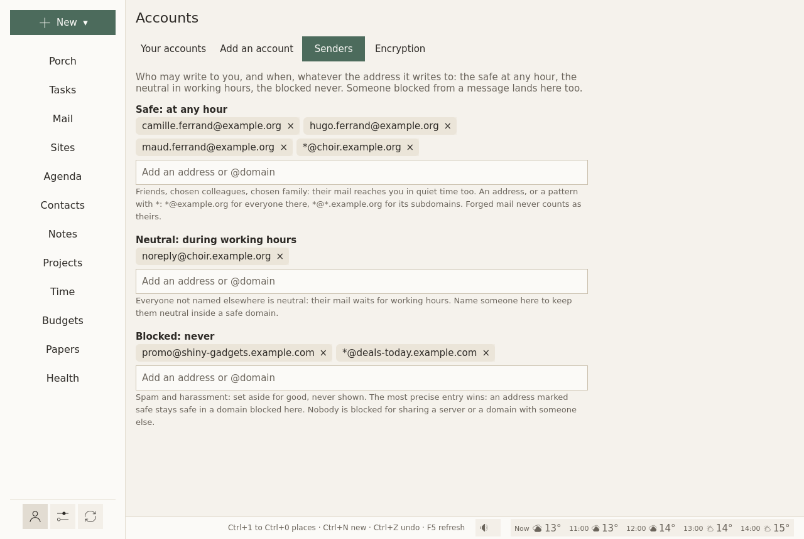

# Accounts

**Accounts** is the person icon at the bottom of the left column. It has four tabs: **Your accounts**, **Add an account**, **Senders**, **Encryption**.

Sites (secure mailboxes, chats) are not accounts: they are made and changed on the [Sites](sites.md) page.

## Your accounts

<figure markdown="span">
  [{ loading=lazy }](../assets/screens/accounts.png "Open the picture at full size")
  <figcaption>One card per address, each of its services with a switch.</figcaption>
</figure>

At the top, **How far back mail and the agenda reach**: from one week to one year, or everything. Older mail is fetched at the next round; "Everything" can take a while, and room on disk.

Then one card per address, with each of its services: **Mail**; **Calendars, tasks and contacts**; **Google: calendars, contacts and tasks**. Each has:

- **a switch**: off, the service keeps its settings and is neither synced nor shown;
- its server, and what its last fetch said, in a sentence;
- **Remove**.

**What this server offers**, at the top of the card, asks the server what else it has: calendars and contacts beside the mail, and for a Nextcloud, its version and its apps. What Sioul can use is added in one click.

### A mail address

On its card, **Settings for this address**, folded until you open it:

- **What this address is for**: work, your admin, leisure, any of them together. Its mail comes in the hours for what it is for. Nothing ticked counts as work, so that it never reaches your evenings. See [Hours](hours.md).
- **How far back**: how many weeks of this address's mail its folders show, or like the other addresses.
- **Fetch every**: how often its folders other than the inbox are fetched; 0 follows the other addresses. A public address can be fetched twice a day (720 minutes).
- **Protected against harassment**, and once it is on, **Let the AI read it first**. See [the Porch](porch.md#a-public-address-protected).

Always in view below it:

- **Priority**: *More important*, *Normal* or *Less important*. See [the Porch](porch.md#some-addresses-first-others-last).
- **Name and signature…**: your name, as recipients see it, and your signature, in Markdown.

Then **Server and folders**, folded: the server, and where its mail is kept on this computer.

Below the cards, **The AI shield** holds the key for Anthropic's service, used only by addresses that let the AI read them first. It is kept in your system's keyring, never in a file; **Forget the key** removes it.

### Removing one

**Remove** asks first. A mail account's password leaves the keyring; its mail stays on your disk and on the server. For Google, the access is given back to Google.

### An account from your other device

[Sharing between your devices](sharing.md) brings your accounts, never their passwords. Such an account says it has no password here yet, with **Password…** on its card: type it, or choose **From Bitwarden…**. Your vault opens (its master password, then its second step: an app's code, an e-mail's, a YubiKey's), and the logins it keeps for this address are listed; choose one. The password is tried with the server, then kept in this device's keyring. **Password…** comes back if the server ever refuses the one kept.

On a phone, a security key cannot open the vault yet: use another second step of your Bitwarden account.

## Add an account

Three forms, one after the other:

- **Add a mail account**: your address, **Find the server**, your password, **Connect and add**.
- **Add contacts and calendars**: from a CalDAV and CardDAV server, such as Nextcloud, Fastmail, iCloud or your host.
- **Google calendars, contacts and tasks**: **Sign in with Google**, on Google's own page.

On a phone, **From this phone's accounts…**, above them, opens Android's own list of the accounts the phone knows. A Google address fills the Google form; any other fills the mail form, whose server Sioul then looks for, and the one for contacts and calendars. Android lends no password: Sioul asks for it once.

Step by step: [First steps](first-steps.md#add-your-mail). Passwords go to your system's keyring, nowhere else.

## Senders

<figure markdown="span">
  [{ loading=lazy }](../assets/screens/accounts-senders.png "Open the picture at full size")
  <figcaption>Who may write to you, and when.</figcaption>
</figure>

Who may write to you, and when, whatever the address they write to. Three lists:

- **Safe: at any hour**: friends, chosen colleagues, chosen family. Their mail reaches you in quiet time too, and skips the screener. Only you put someone there.
- **Neutral: during working hours**: everyone not named elsewhere, strangers included. Name someone here to keep them neutral inside a domain marked safe.
- **Blocked: never**: spam and harassment, set aside for good, never shown, never counted. Nothing is deleted.

Each line is an address, or a pattern with `*`: `*@example.org` for everyone there, `*@*.example.org` for its subdomains. The most precise entry wins: an address marked safe stays safe in a domain blocked here. Nobody is blocked for sharing a server or a domain with someone else.

Forged mail is judged apart, before the lists: a forged message is set aside even when it claims a safe sender's address.

From a message or a contact, **Their mail** puts someone in one of the three lists. The lists themselves, with their patterns, are edited here only.

## Encryption

Your OpenPGP keys, to sign and encrypt your messages ([Mail](mail.md#signing-and-encrypting)):

- **Make a key for** an address: a new key, valid three years; its passphrase is made at random and kept in your keyring, so nothing is asked at each message.
- **Import a key…**: a key exported from GnuPG, with its passphrase, asked once.
- **Save the public key**: into your downloads, to give to others.
- **Keys of others**: those that came with their messages, or from a file, or found by **Look for their keys** in the writing window.

Your own keys stay on this computer. They are not shared with your other computers: copy them by hand if you need them there.
