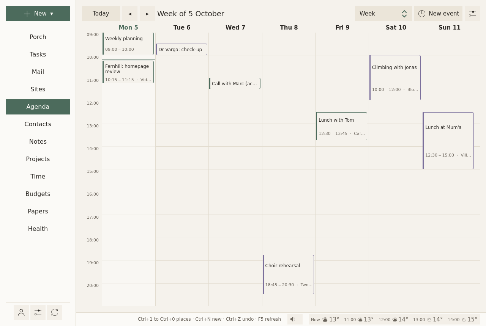

# Agenda

## In short {#in-short}

The agenda shows what comes, from today, as a calm list of days, with the day, the week and the month one switch away. Each event can keep time before it, to get ready and get there, and after it, to come back: your plan keeps that time free, lays your tasks around your events, and moves a meal that falls in one. Sioul tells you when two events overlap, and reminds you once, quietly, before you need to leave. Your events stay on your own calendar server, at Google or on this device, and nothing from an invitation enters your calendar until you answer it.

<figure markdown="span">
  [{ loading=lazy }](../assets/screens/agenda-week.png "Open the picture at full size")
  <figcaption>The week, one switch away from the list.</figcaption>
</figure>

## Protected by default {#what-is-protected}

- Your events stay on your calendar server, at Google, or on this device. Sioul has no server of its own: your plan, your reminders and the check for two events at once are worked out on your device.
- Sioul reaches your calendars only over an encrypted connection, and your password stays in your system's keyring.
- Nothing from an invitation enters your calendar until you answer it. Mail forged outright is set aside, invitation and all, and mail that fails the checks of the address it shows counts as a stranger's, whatever name it shows. Some servers add invitations to your calendar themselves; Sioul then shows what the server holds.
- Your answer to an invitation goes from your own mail account to the organiser, and carries only what the organiser needs: the event, its time and your answer, never the other guests.
- An event's notes show as plain text: nothing in them loads from the network or runs, whoever wrote them.

## Four ways to look

A choice at the top of the page:

- **What comes**: what is still to come today, then the next two weeks, as a list. An event already over is left out. This is where the page opens.
- **Day**, **Week**, **Month**.

The arrows ◂ and ▸ go earlier and later; **Today** comes back to today. Nothing is late or overdue: the past shows only when you go back to it.

The page follows the clock: the line at the current hour moves with it, and today becomes tomorrow at midnight. The page reads your calendars again every five minutes and whenever you come back to Sioul; your calendar server is asked every quarter of an hour, and at once after a change you make.

## Events

**New event**, at the top of the page (or **New ▾ ▸ An event**): a title, when it starts and ends, where. **All day** is one tick. Folded under **More**: its notes; **Repeats**, every day, week, month or year; **Calendar**, which one it goes in, when you have several; and, if you want them:

- **Before** and **After**: the time to get ready and get there, and to come back ([below](#time-around-an-event)).
- **Remind**: when Sioul reminds you of it: as usual (a quarter of an hour before it and its time to get there, unless you change it in [Settings](settings.md#reminders)), not this one, or 5 minutes to 2 hours before. See [Reminders](#reminders).
- How much the event asks of you, and what it gives back: the same tiles as [a task's](tasks.md#what-it-costs-and-what-it-gives-back), **Thinking**, **Feelings**, **Worry**, **Body and senses** and **Gives back**, each from 0 to 10, with a word beside the number and a question in small print. A tap on a cell gives its value, the same tap clears it; each tile stays **unsaid** until you tap it. Your plan counts them ([below](#your-day-around-your-events)).

An event opens on the right with its day, its time, its place, its calendar, and whether it repeats. Its notes, who organised it and its guests are folded under **More**. It opens the same way from a link (a task's tie, the day on the Tasks page), its days shown; its menu (right click, or a long press on a touch screen) offers **Details** first, then **Edit**.

- **To change it**: **Edit**.
- **To delete it**: **Delete**. It waits ten seconds, with **Undo**. A repeating event asks first: **Only this time**, or **Every time**.

An event can also be made from a message, from a task, or from a paper letter's appointment, and stays tied to it. From an event, you can make a note (dated, with its guests listed, and **Send to the guests** once written) or a task to prepare it.

## Time to get ready, get there and come back {#time-around-an-event}

**Before** is the time to get ready and get there; **After**, the time to come back; from 5 minutes to 2 hours each. Your plan keeps that time free and never counts it as a pause, and the day shows it around the event ("Around: …"). Sioul's reminder comes before it, and two events whose journeys overlap are said to overlap.

## Moving an event by hand

In **Day** and **Week**, drag an event to another time: it keeps its length. In **Week**, drag it to another day too. Drag its bottom edge to change when it ends. While you drag, its new place shows with its times ("Tue 6, 11:15–12:15"), by five minutes.

Let go, and it is saved and sent to your calendar server; **Undo** waits ten seconds in the status line. Let go where it was, and nothing changes.

- **A repeating event** asks first: **Only this time**, or **Every time**. Every time moves all its days by as much; a weekly event moved to another day comes on that day each week. An event that repeats on set days of the month ("the first Monday") moves only this time: change how it repeats in its form.
- **A calendar you can only read**, and whole-day events, do not move.
- **With a mouse**: press and drag; the wheel scrolls. **On a touch screen**: hold the event until it lifts, then slide it; a plain swipe scrolls. Held and let go without moving, it opens its menu.
- Only within the hours shown; further, use **Edit**.
- If it now overlaps another event, Sioul says so above the agenda, as for any two events at once. Your plan goes around its new time at once.

## Tasks pinned to a time

A task you pin to a time ([Tasks](tasks.md#pinned-to-a-time)) has its block in your calendar, "Planned tasks" unless you chose another: an event with the task's title, which follows the task's. Move it like any event, here or in another program, and the task moves with it; delete it, and the plan places the task again. Your plan counts it once, as the task.

## Two events at once

When two events overlap, the time to get there and back counted, Sioul says so: today's on the [Porch](porch.md), with a button to open each one; today's and the next two weeks' above the agenda, whatever the view. **Don't mention it again** sets it aside for good, on this device. Move one of them and it is a new question. Once both are over, nothing more is said.

## Your day around your events {#your-day-around-your-events}

Your plan ([Tasks](tasks.md#the-plan)) goes around your events: each holds its time, its Before and After, and five minutes before and after it; an event shorter than a quarter of an hour holds a quarter of an hour. Your tasks go into what is left of your hours. A meal that falls in an event moves after it, for that day only (see [Health](health.md#meals-rest-and-sleep)).

What an event asks of you counts too: a day's events take their share of what that day can hold, and the days before and after a heavy event (a cost of 7 or more) hold less ([Tasks](tasks.md#what-it-costs-and-what-it-gives-back)).

## Invitations

An invitation that comes by mail shows in the message: **Accept**, **Maybe**, **Decline**. Accepted, or maybe, the event goes into your calendar, and your answer goes to the organiser from the address the invitation came to; declined, only your answer goes. Nothing enters your calendar before you answer. An event sent for information shows **Add to my calendar**; a cancelled one, **Take it out of my calendar**. Inviting people from Sioul is not built yet ([Not there yet](#not-there-yet)). See [Mail](mail.md#invitations).

## Reminders

A quiet reminder before each event, a quarter of an hour before it and its time to get ready and get there: "14:00 · Town hall, in 45 minutes", then "Getting ready, getting there: from 13:30." and where, with **Open**. How long before is yours (Settings ▸ Reminders ▸ **Before an event**), and each event can say its own: **Remind**, in its form and in its details, which also say when it reminds; for every time a repeating event comes. Not for whole days, nor for an event cancelled or declined. Calendars you can only read (holidays, subscriptions) get no reminder from Sioul, unless an event in them asks for one; their own alarms still come.

Another, half an hour before work ends, on the last working day before an event: "Mon 12 Oct 09:00 · Town hall", and where. The alarms an event carries (set by you, your phone, or whoever invited you) come at their time too; one within five minutes of Sioul's reminder is told once. While you sleep, a reminder waits for your waking, unless the event itself is in the night: you chose it. No sound, never repeated; on a phone too, Sioul open or not. See [Settings](settings.md#reminders).

## On a phone {#on-a-phone}

On Android, Sioul syncs your calendars itself and keeps its own copy of them: your phone's calendar app shows the same events only through its own sync (DAVx⁵, say). Reminders come while Sioul is closed: Sioul hands the coming ones to Android ahead of time, and Android wakes it at each one's time, so that Sioul checks the event still stands. Sioul's agenda card on the home screen ("Sioul — Agenda") lists your coming events; with **Details on the home screen** off, it shows their times without their titles ([Settings](settings.md#display)). If your phone's calendar app also rings an event's own alarms, turn one of the two off, so that you hear them once; Sioul's own reminder before an event never rings there.

## The Agenda settings

The ⚙ at the top of the page:

- **Calendars**: renamed here and on the server at the next sync. An empty calendar can be deleted; one holding events stays.
- **The day starts at**: the hour the day and week views open on.

## Where events live

On your calendar server, as standard CalDAV events: your phone and other programs see them. Times keep their time zone and show in yours. Editing in Sioul changes only what you changed: a guest list, an alarm or another program's fields stay as they were. What you set in Sioul (Before and After, **Remind**, what the event asks of you) is written into the event itself, so it follows the event to your other devices; your server and your other apps can read it, as they read the event.

Google calendars are made, renamed and deleted on Google's own pages; Sioul greys those settings, and says why.

**How far back mail and the agenda reach** is set at the top of [Accounts](accounts.md#your-accounts).

## Not there yet

Moving an event to another calendar, changing one occurrence's title or place (its time moves by hand), and choosing a calendar's colour here are planned. Not built either: inviting people from Sioul; importing or exporting `.ics` files, and subscribing to a calendar by its address; more than one reminder of Sioul's for an event; choosing an event's time zone. The copy of an invitation kept in your calendar does not record your answer: the organiser has it.

## Going further {#going-further}

- **Repeating events made elsewhere** keep their rule, however rich ("every other Monday and Wednesday", "the first Monday of the month"): changing their title in Sioul leaves the rule whole. Sioul's own form makes every day, week, month or year.
- **Time zones**: an event written in another time zone keeps it and shows in yours; Sioul writes new events in your zone.
- **An event made after its reminder's time** is not reminded: you have just seen it.
- **The working day before** is read from your working hours ([Settings](settings.md#hours)).
- **A calendar file in a message**: an `.ics` that a message carries goes into your calendar with **Add to my calendar**.
- **Two calendars, one event**: the same event in two of your calendars (the same UID at the same start) is not taken for two events at once.

## Compared with other apps {#compared-with-other-apps}

**Time around events, and a plan around them.** Sioul keeps time before and after each event, set by you, and counts it everywhere at once: in your plan, in the warning for two events at once, and in its reminder. Apple Calendar and Fantastical keep a travel time before an event only, and tell you when to leave from live traffic, which Sioul does not. Morgen computes travel time both ways with Google Maps, and Reclaim adds a fixed travel time both ways, each for Google and Outlook calendars (Morgen also for iCloud and Fastmail), with an account at them. Morgen's AI Planner and Reclaim's Habits also lay work and routines, such as lunch, around your events; Sioul does it on your device, from your own hours, meals and nights, with any CalDAV server and no account elsewhere. Sioul cannot send invitations, move an event to another calendar, import or export `.ics` files, or show birthdays by itself, where most others can; and among these apps, only Proton encrypts what an event says end to end, its times aside.

As of October 2026, from each app's own documentation.

✓ documented; **partly**, with a note; ✗ not found in the app's own documentation (for Sioul: not built); ? not confirmed; — not applicable. Sioul's column was checked against its code.

=== "Everyday"

    | | Sioul | Google | Apple | Outlook | Thunderbird | Morgen |
    |---|---|---|---|---|---|---|
    | Keeps time to get there before an event, and to come back after | ✓¹ | ✗² | partly³ | partly⁴ | ✗⁵ | ✓⁶ |
    | Says when to leave, from the traffic | ✗⁷ | ✗⁸ | ✓⁹ | ✗¹⁰ | ✗ | partly¹¹ |
    | Warns when two events overlap | ✓¹² | ? | ? | partly¹³ | ✗ | partly¹⁴ |
    | Places your tasks around your events, meals and rest kept | ✓¹⁵ | ?¹⁶ | ✗ | partly¹⁷ | ✗ | ✓¹⁸ |
    | Several reminders for one event | partly¹⁹ | ✓ | ✓ | ?²⁰ | ✓²¹ | ✓ |
    | Repeats on rules like "the first Monday" | partly²² | ✓ | ✓ | ✓ | ✓ | ✓ |
    | Answers invitations that come by mail | ✓ | ✓ | ✓ | ✓ | ✓ | partly²³ |
    | Sends invitations | ✗ | ✓ | ✓²⁴ | ✓ | ✓ | ✓ |
    | Moves an event by dragging, with undo | ✓ | ✓ | partly²⁵ | ?²⁶ | ✓ | partly²⁷ |
    | Moves an event to another calendar | ✗ | ✓ | ✓ | ✓ | ✓ | ? |
    | Shows your contacts' birthdays | ✗²⁸ | ✓ | ✓ | ✓ | ✗ | ? |

    1. **Before** and **After**, 5 minutes to 2 hours each, kept free by your plan and counted by the overlap check and the reminder.
    2. Neither the event form nor the complete settings on Android have a travel or preparation time.
    3. A Travel Time before the event, added to its length; nothing after it.
    4. No time per event; one setting shortens all your meetings ("end early" or "start late") to leave gaps.
    5. Requested in 2009, and declined.
    6. Morgen Assist computes travel time with Google Maps, before events with an address and, if you wish, after them; for Google, Outlook, iCloud and Fastmail calendars; every plan is paid.
    7. Sioul's reminder comes before your **Before**, at a time you choose; it does not read the traffic.
    8. Not in Google Calendar; Google's Waze app gives such alerts from the phone's calendar.
    9. From the event's place, your likely location and the traffic or transit, for trips under three hours.
    10. Not on a computer or the web; the phone app's "Time to Leave" came from Cortana, retired in 2023.
    11. The travel block shows when to leave; an alert for it is not described.
    12. On the Porch for today, and above the agenda for two weeks, with each event's time to get there and back.
    13. For invitations: a conflict notice, a view of where the invitation falls, and a choice to decline conflicting invitations.
    14. The AI Planner warns when a meeting lands on a planned task; two overlapping events are not described.
    15. Your plan lays your tasks in your hours around your events, their Before and After and five minutes around each; a meal that falls in an event moves after it; the days around a heavy event hold less.
    16. Not described in Google's help; Gemini's "Suggested times", on paid Workspace plans, proposes meeting slots.
    17. Work accounts with Viva Insights book focus time, breaks and a lunch; To Do tasks are placed by dragging them.
    18. The AI Planner proposes up to 8 days of tasks, breaks adjustable, written once you approve; "Routines" hold fixed blocks such as lunch.
    19. One reminder of Sioul's before each event (its time chosen per event, or none), and the alarms the event carries.
    20. Microsoft describes one reminder choice per event, and one default per account.
    21. Several per event; one default for all calendars; reminders come only while Thunderbird runs.
    22. Sioul keeps any rule made elsewhere, and makes every day, week, month or year.
    23. Morgen answers on events with guests, through the calendar's provider; it reads no mail.
    24. With iCloud, Exchange and some CalDAV servers.
    25. Drag to move on the Mac and the iPhone; an undo is not described in Apple's guides.
    26. Dragging an event to another calendar is described; moving it in the grid, and undoing that, are not described in the pages read.
    27. Drag and drop is described; an undo is not.
    28. Sioul makes no birthday calendar; one your server keeps (Nextcloud keeps one) shows as any other calendar you can only read.

=== "Technical"

    | | Sioul | Google | Apple | Thunderbird | DAVx⁵ + Fossify or Etar | Proton |
    |---|---|---|---|---|---|---|
    | Any CalDAV server, read and write | ✓ | partly¹ | ✓ | ✓ | ✓ | ✗² |
    | Google calendars, read and write | ✓ | — | ✓ | ✓ | ✓ | partly³ |
    | Answers invitations from any system by mail (iMIP) | ✓ | ?⁴ | ✓ | ✓ | ✗⁵ | ✓⁶ |
    | Imports and exports `.ics` files, subscribes by address | ✗⁷ | ✓⁸ | ✓ | ✓ | partly⁹ | ✓ |
    | Chooses an event's time zone | partly¹⁰ | ✓ | ✓ | ✓ | ✓ | ✓ |
    | Events encrypted end to end | ✗¹¹ | ✗¹² | ✗¹³ | ✗ | ✗ | partly¹⁴ |
    | Free software | ✓ GPL-3.0+ | ✗ | ✗ | ✓ MPL-2.0 | ✓ GPL-3.0 | ✓ GPL-3.0¹⁵ |

    1. Other apps reach Google Calendar by CalDAV; its phone apps show the calendars of accounts the phone already syncs, and its web app adds only Google calendars and public links.
    2. "Proton Calendar doesn't support CalDAV, so you can't set up a direct two-way sync with an external calendar."
    3. A one-time import, or a read-only subscription to Google's secret iCal address.
    4. You answer in Calendar or Gmail; invitations from other systems are not described.
    5. The apps set your answer on events already in a synced calendar; an invitation in a mail cannot be answered from it.
    6. From Proton Mail; invitations from other providers are added to your calendar as they arrive, where Sioul adds nothing until you answer.
    7. An `.ics` that a message carries goes in with **Add to my calendar**; no import from a file, no export, no subscription by address.
    8. On a computer only.
    9. Both apps import and export `.ics` files; subscribing by address needs ICSx⁵.
    10. An event made elsewhere keeps its time zone and shows in yours; Sioul writes new events in your zone.
    11. Events on a server can be read by that server, as with every CalDAV app; calendars kept on a device only travel sealed between your devices.
    12. Client-side encryption on some paid Workspace plans only, for the description, attachments and Meet data, not the title, the time or the guests.
    13. Not with Advanced Data Protection either: Apple says CalDAV has no end-to-end encryption built in.
    14. The title, description, place and guests are encrypted on your device; the start and end, time zone, repetition and alarms are only signed, and Proton's servers read them.
    15. The web client's code is under GPL-3.0; Proton says all its apps are open source.

**Other calendars.** Fantastical (Mac, iPhone, iPad, Apple Watch, Vision Pro, Windows) adds, with its Premium plan, a travel time before an event, from home, work or the previous event, and "time to leave" alerts from your location and the traffic; it reads any CalDAV account, places no tasks by itself, and does not describe a warning for overlapping events. Reclaim.ai, a web app over Google Calendar or Outlook only, adds travel time before and after events with an address, and time to prepare or unwind around meetings; it places habits such as lunch in a window and moves them when a meeting lands on them, and keeps your primary calendar's events in its own databases. On Android, Fossify Calendar adds your contacts' birthdays and moves events by dragging, by whole hours; Etar does neither.

??? info "Sources"
    - Google Calendar: settings on Android, <https://support.google.com/calendar/answer/6084644?co=GENIE.Platform%3DAndroid>, read 8 October 2026.
    - Waze: calendar events and when to leave, <https://support.google.com/waze/answer/6341187>, read 8 October 2026.
    - Google Workspace Updates: meeting suggestions with Gemini in Calendar (January 2026), <https://workspaceupdates.googleblog.com/2026/01/improved-meeting-suggestions-gemini-calendar.html>, read 8 October 2026.
    - Google Calendar: notifications and reminders, <https://support.google.com/calendar/answer/37161>, read 8 October 2026.
    - Google Calendar: answering invitations, <https://support.google.com/calendar/answer/37135>, read 8 October 2026.
    - Google Calendar: importing and exporting events, <https://support.google.com/calendar/answer/37118>, read 8 October 2026.
    - Google Calendar: other calendars on Android, <https://support.google.com/calendar/answer/13322290?co=GENIE.Platform%3DAndroid>, read 8 October 2026.
    - Google Calendar: birthdays, <https://support.google.com/calendar/answer/6084659>, read 8 October 2026.
    - Google for Developers: CalDAV API guide, <https://developers.google.com/workspace/calendar/caldav/v2/guide>, read 8 October 2026.
    - Google Workspace Updates: client-side encryption in Calendar (February 2023), <https://workspaceupdates.googleblog.com/2023/02/client-side-encryption-google-calendar.html>, read 8 October 2026.
    - Calendar for Mac: events, travel time and calendars, <https://support.apple.com/guide/calendar/icalwr13-events/27.0/mac/27>, read 8 October 2026.
    - Calendar for Mac: time to leave, <https://support.apple.com/guide/calendar/icl40727/27.0/mac/27>, read 8 October 2026.
    - Calendar for Mac: alerts, <https://support.apple.com/guide/calendar/icl624fd1912/27.0/mac/27>, read 8 October 2026.
    - Calendar for Mac: holidays and birthdays, <https://support.apple.com/guide/calendar/show-holidays-and-birthdays-iclead4e0ec3/mac>, read 8 October 2026.
    - iPhone User Guide: inviting others in Calendar, <https://support.apple.com/guide/iphone/iph82c5721ca/ios>, read 8 October 2026.
    - Apple: iCloud data security overview, <https://support.apple.com/en-us/102651>, read 8 October 2026.
    - Outlook: ending meetings early or starting them late, <https://support.microsoft.com/en-us/outlook/calendar/end-meetings-early-or-start-late>, read 8 October 2026.
    - Microsoft: the end of support for Cortana, <https://support.microsoft.com/en-us/cortana/end-of-support-for-cortana>, read 8 October 2026.
    - Outlook: introduction to the calendar, <https://support.microsoft.com/en-us/outlook/calendar/introduction-to-the-outlook-calendar>, read 8 October 2026.
    - Viva Insights: time management, <https://support.microsoft.com/en-us/viva/insights/time-management-features-in-viva-insights>, read 8 October 2026.
    - Outlook: notifications and reminders, <https://support.microsoft.com/en-us/outlook/calendar/add-or-delete-notifications-or-reminders-in-outlook>, read 8 October 2026.
    - Outlook: a birthday calendar, <https://support.microsoft.com/en-us/outlook/calendar/add-a-birthday-calendar-and-reminder-in-outlook>, read 8 October 2026.
    - Thunderbird: bug 478376, travel time (won't fix), <https://bugzilla.mozilla.org/show_bug.cgi?id=478376>, read 8 October 2026.
    - Thunderbird: the calendar's settings, its strings, <https://github.com/thunderbird/thunderbird-desktop/blob/main/calendar/locales/en-US/calendar/preferences.ftl>, read 8 October 2026.
    - Thunderbird: bug 285200, a warning for overlapping events (open), <https://bugzilla.mozilla.org/show_bug.cgi?id=285200>, read 8 October 2026.
    - Thunderbird: bug 353492, several reminders for one event, <https://bugzilla.mozilla.org/show_bug.cgi?id=353492>, read 8 October 2026.
    - Thunderbird: bug 134969, reminders while Thunderbird is closed (open), <https://bugzilla.mozilla.org/show_bug.cgi?id=134969>, read 8 October 2026.
    - Thunderbird: bug 151994, a birthday calendar from the address book, <https://bugzilla.mozilla.org/show_bug.cgi?id=151994>, read 8 October 2026.
    - Morgen: travel time, <https://www.morgen.so/guides/auto-schedule-travel-time>, read 8 October 2026.
    - Morgen: questions and answers, <https://www.morgen.so/faq?84acd400_page=3>, read 8 October 2026.
    - Morgen: planning your day with the AI Planner, <https://www.morgen.so/guides/plan-your-day-using-the-ai-planner>, read 8 October 2026.
    - Morgen: Routines, <https://www.morgen.so/guides/morgen-routines-guide>, read 8 October 2026.
    - Morgen: several alerts for an event, <https://www.morgen.so/guides/how-to-add-multiple-alerts-to-calendar-events>, read 8 October 2026.
    - Morgen: prices, <https://www.morgen.so/pricing>, read 8 October 2026.
    - Proton: external calendars, and no CalDAV, <https://proton.me/support/subscribe-to-external-calendar>, read 8 October 2026.
    - Proton: moving calendars from Google, <https://proton.me/support/easy-switch-calendars>, read 8 October 2026.
    - Proton: adding an event from your inbox, <https://proton.me/support/add-event-from-inbox>, read 8 October 2026.
    - Proton: Proton Calendar's security model, <https://proton.me/blog/protoncalendar-security-model>, read 8 October 2026.
    - Proton: the web clients' licence, <https://github.com/ProtonMail/WebClients/blob/main/LICENSE>, read 8 October 2026.
    - Proton: open source, <https://proton.me/community/open-source>, read 8 October 2026.
    - DAVx⁵ manual: technical information, <https://manual.davx5.com/technical_information.html>, read 8 October 2026.
    - DAVx⁵ manual: accounts and collections, <https://manual.davx5.com/accounts_collections.html>, read 8 October 2026.
    - Fossify Calendar: its repository, <https://github.com/FossifyOrg/Calendar>, read 8 October 2026.
    - Fossify Calendar: issue 207, answering an invitation from a mail, <https://github.com/FossifyOrg/Calendar/issues/207>, read 8 October 2026.
    - Etar: issue 97, deleting one occurrence, <https://github.com/Etar-Group/Etar-Calendar/issues/97>, read 8 October 2026.
    - Etar: issue 234, birthdays, <https://github.com/Etar-Group/Etar-Calendar/issues/234>, read 8 October 2026.
    - Fantastical: travel time, <https://flexibits.com/fantastical/help/travel-time>, read 8 October 2026.
    - Fantastical: getting started, <https://flexibits.com/fantastical/help/getting-started>, read 8 October 2026.
    - Flexibits: prices, <https://flexibits.com/pricing>, read 8 October 2026.
    - Reclaim.ai: buffer time, travel and decompression, <https://help.reclaim.ai/en/articles/4281992-buffer-time-overview-travel-decompression-and-tasks-habit-breaks>, read 8 October 2026.
    - Reclaim.ai: Habits, <https://help.reclaim.ai/en/articles/17124978-habits-agents-overview-automate-your-recurring-routines>, read 8 October 2026.
    - Reclaim.ai: security, <https://reclaim.ai/security>, read 8 October 2026.
    - Reclaim.ai: prices, <https://reclaim.ai/pricing>, read 8 October 2026.

## For technical readers {#for-technical-readers}

- **iCalendar** (RFC 5545): one event and its exceptions per file, as CalDAV stores them (RFC 4791, section 4.1). Repeating events are expanded with calcard (`RRULE`, `RDATE`, `EXDATE`, `RECURRENCE-ID` overrides), each in its own time zone, shown in yours; a changed occurrence is matched by its `RECURRENCE-ID` alone, as RFC 5545 says, even when the series' `SEQUENCE` moved on. New one-off events are written in UTC; repeating ones in your zone, with a `VTIMEZONE` Sioul writes. An edit rewrites only the lines that changed and raises `SEQUENCE`; alarms, guests and other programs' properties are kept.
- **Sioul's own properties** travel inside the event: `X-SIOUL-BEFORE` and `X-SIOUL-AFTER` (minutes, a day at most), `X-SIOUL-COST`, `X-SIOUL-GAIN`, `X-SIOUL-REMIND` and `X-SIOUL-TASK` for a task's time block. `X-SIOUL-REMIND` is deliberately not a `VALARM`, so that your other calendar apps do not ring it twice, and so that "not this one" can be said. Ties are RFC 9253 `LINK` and `RELATED-TO` lines. Apple's travel time (`X-APPLE-TRAVEL-DURATION`) is not read.
- **CalDAV** (RFC 4791, over WebDAV): the same client as for contacts. Discovery by RFC 6764 and the current user's principal (RFC 5397), sync tokens (RFC 6578), `calendar-multiget`, writes with `If-Match` and the item's ETag; when both sides changed an event, the server's version wins and yours is kept in `$XDG_STATE_HOME/sioul/dav/conflicts`, named in the status line. HTTPS only, TLS by rustls with the system's root certificates. Each account syncs every fifteen minutes and at once after a change here; the page reads its files again every five minutes, when it comes back into view, and at midnight.
- **Google calendars** go through Google's CalDAV, with OAuth 2.0 for native apps (RFC 8252) and PKCE (RFC 7636); the refresh token in the keyring, the access token in memory only. Calendars cannot be made, renamed or deleted there from Sioul, and Google adds your default reminders to every event ([Works with](compatibility.md#google)).
- **Invitations**: the `text/calendar` part of a message (iMIP, RFC 6047) is read as iTIP (RFC 5546): `REQUEST`, `CANCEL`, `PUBLISH`, parsed by Sioul itself; no other program opens it. The answer is an iTIP `REPLY` with your `PARTSTAT` (`ACCEPTED`, `TENTATIVE`, `DECLINED`), sent as a two-part message from the account the invitation came to, through that account's own SMTP server. It carries `UID`, `SEQUENCE`, `DTSTART`, `DTEND` or `DURATION`, `SUMMARY`, `ORGANIZER`, `RECURRENCE-ID`, the time zones they name, `DTSTAMP` and your own `ATTENDEE` line: no other guest, no description, no place. The event is stored as the organiser sent it, without `METHOD` (RFC 4791, section 4.1). An invitation reaches a calendar only by **Accept**, **Maybe** or **Add to my calendar**.
- **Forged mail**: a message whose DMARC fails under a `quarantine` or `reject` policy (outside mailing lists) is judged forged and set aside, never deleted; its invitation is not among your messages unless you open what was set aside.
- **Overlaps**: timed events of positive length that are not cancelled, each widened by its Before and After; the same UID at the same start in two calendars is not a double booking. The pairs you set aside are kept in `$XDG_STATE_HOME/sioul/overlaps-set-aside.toml`, on this device.
- **Reminders on Android**: the next eight days' reminders, a hundred at most, are handed ahead to Android's alarm manager (`setExactAndAllowWhileIdle` when "Alarms & reminders" is allowed, else up to an hour late); at its time, a receiver asks Rust whether the event still stands. Sioul's reminders use a quiet "Events" channel; an event's own alarms use another. Sioul syncs calendars itself and does not use Android's calendar provider. **On a computer**, reminders come from the window, or with the window closed from `sioul remind --watch`, started with your session when you ask for it.
- **Showing an event**: its notes and an invitation's title are shown as plain text (`Text.PlainText`); HTML descriptions (`X-ALT-DESC`) are not read.
- **Storage**: one `.ics` file per event in vdir folders (`~/.local/share/sioul/calendars`), which khal and vdirsyncer read too, in folders of mode 0700 on Linux and macOS, or in the app's private storage on Android. Sioul does not encrypt them on the disk: your disk encryption does. Events on a CalDAV server can be read by that server. Calendars kept on a device only travel between your devices sealed, in the part **Lists kept here** (XChaCha20-Poly1305, under a key made from your passphrase by Argon2id).
