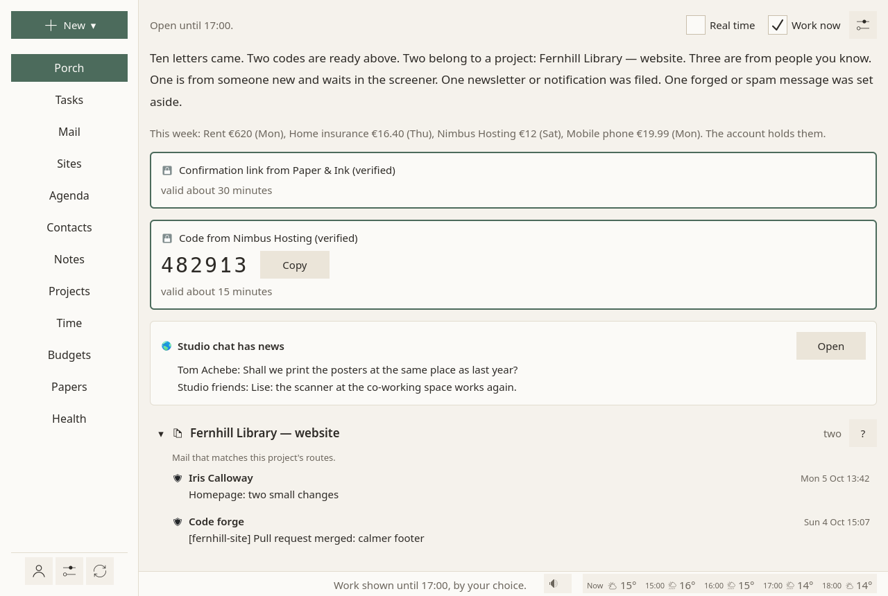

# Hours: work, your admin, free time

Two questions decide what Sioul brings forward, and they are kept apart:

- **Who may reach you**: the people you marked safe, neutral or blocked ([Accounts ▸ Senders](accounts.md#senders)).
- **What a thing is for, and whether these hours are for it**: this page.

They meet in one place. Mail from someone you marked safe, mail you send yourself, and the codes and links you just asked a site for always come, whatever the hours. Everything else comes when what it is for fits the hours.

This is a matter of health before it is a filter. Work that reaches the evening keeps people from recovering, and the risk is highest for those who work from home or for themselves, for whom nothing else marks the end of the day. Admin spread over every evening weighs too, even when nobody is working.

## What each thing is for

A source or a task is for **work**, for **your admin** (bills, letters, offices, health errands), or for **leisure** (friends, family, chats, what you enjoy). These are switches, not a single choice: an address for everything personal is for admin and leisure; a freelancer's bank account, used for both, is for work and admin; a chat used with colleagues and with friends is for both.

| Thing | Where you say what it is for | When you have not said |
|---|---|---|
| A mail address | on its card in [Accounts](accounts.md#a-mail-address): **What this address is for** | work: an address you did not classify never reaches your evenings |
| A budget | its form: **For** | your admin |
| A site | its menu: **For** | by its type: secure mailboxes and client areas are admin; chats, social networks and dating are leisure; video calls and other sites are admin and leisure |
| A task | its panel: **For** | by its tags and project: work's (a client's project, GitHub, the categories you call work), leisure's (joy, family, friends…), both admin and leisure for personal ones (health), else admin |

Mail addresses are the one place nothing is guessed for you: saying what each address is for is what separates a business address from a personal one.

## The hours

In [Settings ▸ Hours](settings.md#hours), three weeks: **Working hours**, **Hours for your admin**, and **Free time**. Each day of each is on or off, with one range of hours or several (09:00–12:00 and 14:00–17:00, a lunch between). **Time off**, below them, takes holidays and sick leave.

Hours set for none of them are **rest**: only the people you marked safe reach you, with the sites for leisure; no tasks, no projects, no time. Time off, and a day closed with "Done for today", are free time.

| In these hours | What comes forward | What waits |
|---|---|---|
| Working hours | work; your admin too, until admin has hours of its own; a call to an office, always | leisure |
| Hours for your admin | your admin; work too, while work has no hours | leisure |
| Free time | leisure, and nothing else | work and admin |
| Rest (outside all of them: nights, days without any) | mail from your safe senders, codes you asked for; sites for leisure | everything else: tasks, projects, time, your admin, work |
| No hours set at all | everything, as before any were set | nothing |

Hours may overlap: admin hours inside free time on a Saturday afternoon, say. Then what each of them brings comes, all together.

The status line says what the hours are now, and until when: "Admin time until 19:00: offices, bills, letters."

## What follows the hours

- **Mail**: it comes when its address's area fits the hours. In free time, an address that is also for admin or work shows only what your safe senders write: the rest may be a bill or a client.
- **Sites**: the sites for these hours are listed first; the others fold under "Other hours". Their notifications wait for their hours, real time and calls included.
- **Tasks**: the task pages keep what fits, and the plan places each task in the hours meant for it: work in working hours, your admin in admin hours, leisure in free time. The next step is never a call to an office that is closed now.
- **Budgets**: by what each one is for.

## Quiet time

Quiet time is the evening, the days without working hours, time off, and the rest of a day you closed with **Done for today**. Work rests until it comes back:

- the Porch shows codes, mail from your safe senders, and mail of the addresses whose hours these are;
- work addresses fold on the Mail page, without their dots;
- work sites keep their notifications for later;
- Projects shows only yours, and Time waits behind **Show anyway**;
- Tasks shows only yours.

One sentence in the status line says when work comes back: "Work comes back tomorrow at 09:00."

## Rest

Outside every hours you set (work, admin, free time), it is rest: the night, mostly. Only the people you marked safe reach you:

- the Porch shows codes you asked for and mail from your safe senders, nothing about money or paper letters; a message from a safe sender about a project comes among the people you know;
- every address folds on the Mail page;
- only the sites for leisure are listed;
- Tasks, Projects and Time wait behind one sentence and **Show anyway**; on Tasks, a thought can still be noted for later.

The status line says until when: "Rest until 09:00: only the people you marked safe reach you."

**The way back is never suggested.** It is there if you need it: the sentence in the status line opens a menu, with **Work half an hour more**, an hour, two hours, four hours; **Back to the usual hours**; or, the day you closed it, **Back to today's plan**.

## Work now

**Work now** shows work whatever the hours, as in working hours. In quiet time, it is a box beside **Real time** on the Porch, and a choice in the status line's menu on every page.

<figure markdown="span">
  [{ loading=lazy }](../assets/screens/work-now.png "Open the picture at full size")
  <figcaption>Work now: work shown whatever the hours, until you untick it.</figcaption>
</figure>

It ends when you untick it, when Sioul closes, or once the next working day is over; without working hours, at midnight. The status line says until when. Sioul does not keep it on after a restart.

## When no hours are set

The Porch asks, in a card, for the hours not set yet, with **Set my hours**, which opens Settings at them, and **Leave as is**, which stops asking. Nothing changes until you set some.

## What is not decided for you

- **A bank account used for both work and admin** comes in working hours and in admin hours, not in free time. Sioul does not split its movements between business and personal: that is for you, or your accountant. Keeping the business account apart keeps its alerts out of your evenings.
- **Admin hours in the evening** leave calls to offices for working hours, when offices answer. If you would rather keep working hours for work, give admin a slot during the day, such as Tuesday from 14:00 to 16:00.
- **Setting only admin hours** keeps work in them: work comes in admin hours while it has none of its own. Outside them, rest.

## Why it works this way

- Detaching from work outside working hours goes with less exhaustion (r = −.38 across 91 samples: Wendsche & Lohmann-Haislah 2017), and the most exhausted detach least (Sonnentag et al. 2014).
- Work messages in the evening cost the evening through their tone (Butts, Becker & Boswell 2015), and merely expecting to check them does harm, read or not (Becker et al. 2021).
- Unfinished tasks feed rumination and poor sleep (Syrek et al. 2017); planning where, when and how they will be done raised evening detachment (Smit 2016). So closing the day gives everything a place, and names the first step.

More in [what the research says](../dev/research.md), findings 21 to 23.
