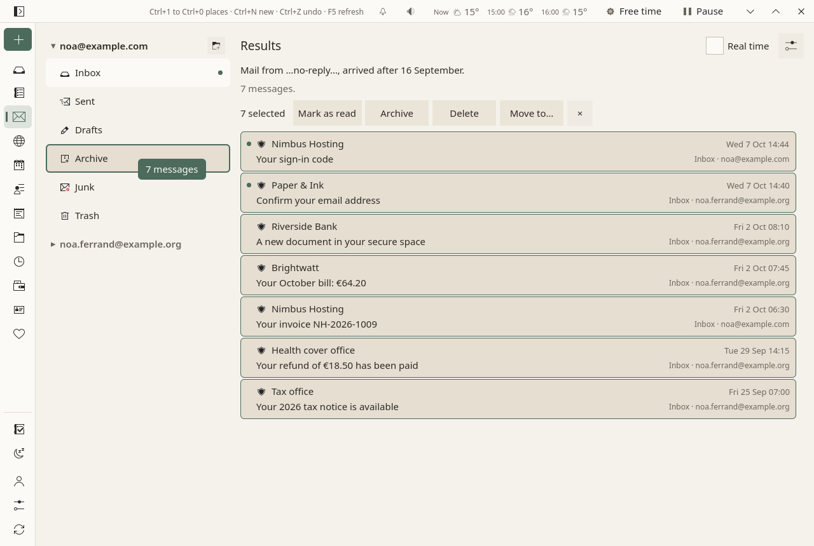

# Mail

The Porch is for what is new. The Mail page is for when you choose to look: every address, every folder, all the mail kept. It keeps the Porch's calm: no unread counts, no badges, no red.

<figure markdown="span">
  [{ loading=lazy }](../assets/screens/mail.png "Open the picture at full size")
  <figcaption>Folders on the left, the last two weeks in the middle, no counts.</figcaption>
</figure>

## Folders

- **On the left**, each address with its main folders: Inbox, Sent, Drafts, Archive, Junk, Trash. The others are folded under **More folders**.
- **A small dot** marks a folder with something new. How many is said in words when you open it.
- **A folder shows its last two weeks.** **Earlier messages** opens the rest, so that no list is endless.
- **Search**, at the top of a folder: by sender, recipient and subject. **More…**, beside it, searches everywhere, by conditions ([below](#searching)).
- **By conversation**, in the Mail page's ⚙: a message and its answers together, under the newest one; your own answers come from Sent.

A right click on a folder offers **Keep a copy here** or **Stop keeping a copy** (the server keeps every message either way), **New folder…**, and **Delete this empty folder**, for an empty folder of yours.

## Searching

The field at the top of a folder finds a sender, a recipient or a subject in that folder. When you need more, **More…**, beside it, opens the search by conditions in the folders' place. Nothing of it shows until then.

<figure markdown="span">
  [{ loading=lazy }](../assets/screens/mail-search.png "Open the picture at full size")
  <figcaption>The search in the folders' place; the results in the usual list, each saying where it is.</figcaption>
</figure>

- **One condition at first**, Anywhere, with what you had typed in the folder's search. **Add a condition** for another: the sender, the recipients, the subject, the text, an attachment (there is one, none, one with a name), the kind of attachment (a PDF, a picture…), the day it arrived, its size, who the sender is to you, a newsletter or a list, the address, the folder, and whether it is read, flagged or answered. Case and accents do not matter.
- With two conditions or more, choose **Mail that meets all of them** or **any of them**.
- **The results** take the list's place, the newest first, each saying where it is. A message opens beside them as in a folder, so you go back and forth between the results and the messages. Above them, a sentence says what is searched: "Mail from …@bank.example…, arrived after 3 June, with an attachment."
- **Everywhere**: every folder of every address, but the junk and the trash, unless you name them in a Folder condition.
- **On the servers too**: Sioul keeps your recent mail here, and brings older mail as the disk has room; folders you keep on the server only are not here at all. A moment after you stop typing (at once with ++enter++), Sioul asks your servers for the rest, and says so: "Looking on the servers…", then "3 more on the servers.", or why a server could not be searched. Those messages say "on the server"; opening one brings it here first. A server minds accents more than Sioul does: write them as the messages do.
- **Clear** goes back to the folder.
- **Make it a filter…**, beside it, turns the search into a mail filter: its editor opens in the Mail page's ⚙, to choose what it does with such mail as it arrives.

The conditions are the ones [mail filters](#filters) use, in the same words.

## Filters

Filters act on new mail as it arrives, on its server: into a folder, archived, to spam, flagged, marked read, to the trash, or with a keyword. They are in the Mail page's ⚙, under **Filters**: one list for all your addresses, each filter in a sentence.

<figure markdown="span">
  [![The Mail page with its settings open on the right, under Filters: a short paragraph on what filters do, “Show the filters of: Every address”, then four filters, each a switch and a sentence: Bank, “From contains “@riversidebank.example.org” → into “Archive”, marked read, and no other filter”; “Sent by a newsletter or a list and arrived on a Saturday or Sunday → marked read”; “From contains “@deals-today.example.com” → into the junk, as spam”, only for noa.ferrand@example.org; Invoices, switched off and dimmed; then Add a filter, and Run them on the inboxes….](../assets/screens/mail-filters.png){ loading=lazy }](../assets/screens/mail-filters.png "Open the picture at full size")
  <figcaption>Each filter in one sentence, with its switch; switched off, it is kept and does nothing.</figcaption>
</figure>

- **Add a filter** opens it in place, with one condition and one action. Choose what the condition reads (From, To, Cc, Reply-To, Subject, Text, Anywhere, an attachment, its kind, who the sender is to you, a newsletter or a list, the day or the time it arrived, its size), how it compares (contains, does not contain, is, is not; before, after, between; larger, smaller), and what it looks for. **Add a condition** for another; with two or more, choose whether **every condition holds** or **one of them holds**. Case and accents do not matter, as in the search.
- **Then**: move it to a folder, archive it, mark it as spam, flag it, mark it as read, move it to the trash, or add a keyword. **Add an action** for another.
- **A sentence** says the filter as you build it, and what is missing if anything is: "Choose the folder it moves messages into." Every change is kept at once.
- Folded under one line: **On which addresses** it acts (every address, or some), and **Once it acts, the filters below are not asked**.
- **Try it on the inboxes** counts what it takes in your inboxes now, read or not, and names a few.

<figure markdown="span">
  [{ loading=lazy }](../assets/screens/mail-filter-editor.png "Open the picture at full size")
  <figcaption>A filter open: its condition, its actions, and what it takes in your inboxes now.</figcaption>
</figure>

- **The order** matters: the first filter that moves a message decides where it goes. ▴ and ▾ ask a filter earlier or later. With several addresses, **Show the filters of** shows those of one address.
- **When they act**: on mail that arrives unread in an inbox, on the first of your devices to fetch it (this computer, your phone in the background, `sioul watch`). That device marks the message on its server, so that your other devices leave it alone. Your filters travel to your other devices with your settings.
- **What they never touch**: mail the Porch sets aside, a code you asked for, what your spam filter keeps for review. Nothing is deleted for good: the trash keeps it.
- **Not told**: a message a filter moves out of the inbox, or marks read, is not notified, and does not wait on the Porch. When a filter cannot act on a message (a folder missing, the server refusing), the message is notified as any new mail, and the status line says why.
- **Run them on the inboxes…** applies them to everything in your inboxes now, read mail too. Sioul first says what would change; **Run them now** does it after ten seconds, with **Undo**.
- **From a search**: **Make it a filter…**, beside the search's Clear, makes a filter of its conditions and opens it at the end of the list, for you to choose what it does.

## Reading

A message opens on the right; the folders fold away while you read. Its sender, how far they are verified, its attachments and the earlier messages it quotes are shown as on [the Porch](porch.md#reading-a-message).

<figure markdown="span">
  [{ loading=lazy }](../assets/screens/mail-reader.png "Open the picture at full size")
  <figcaption>A message: who sent it and how far that is verified, then its text, made safe.</figcaption>
</figure>

Above the message, always in the same place:

- **Reply**, **Reply to all** (only when there are others to answer), **Forward**;
- **Add ▾** (a task, an event, a note, a reply, the sender to your contacts) and **Link to…** (anything else: a task, a note, a project);
- **Archive**, **Delete**, **Junk**;
- **Unsubscribe**, on a newsletter or a list's message that says how to leave it ([below](#unsubscribing)).

Archiving, deleting and junking happen at once, with **Undo** in the status line for ten seconds; the server is told only after that. There is no "are you sure?". In the trash, **Delete for good** deletes it for good, with the same ten seconds.

What you mark **Junk**, or **Not junk** in the junk folder, teaches your own spam filter at its next training ([below](#your-own-spam-filter)).

A right click on a message (or its ⋮, or the Menu key) gives the rest: mark as read or unread, flag, **Move to…**, **Show the source**, block the sender, **How they reach you…** (their list, Always through, what reaches you from them: [A person's sheet](notifications.md#a-persons-sheet)), **Keep as a contract…**.

Opening a message marks it read, as any mail program does.

### Several at once

- ++ctrl++ + click adds a message to the selection or takes it out; ++shift++ + click takes everything since the last one clicked; ++ctrl+a++ takes all; ++escape++ none. On a touch screen, a long press opens a message's menu: **Select**, then a tap chooses more, or leaves one.
- A bar then marks them read, archives, deletes or moves them, under one **Undo**, however many there are.
- **Drag** them onto any folder of any address: the folder under the pointer is outlined. From a search's results too, which is how a busy inbox is sorted: the folders come back in the search's place while you drag. Into another address, a message is taken off the first one only once the second server has it.
- **Move to…**, in the bar or in a message's menu (right click, ⋮, or the Menu key), does the same from the keyboard, and on a phone.

<figure markdown="span">
  [{ loading=lazy }](../assets/screens/mail-search-drag.png "Open the picture at full size")
  <figcaption>Sorting from a search: the messages chosen, dragged onto a folder.</figcaption>
</figure>

### Unsubscribing

A newsletter or a list's message that says how to leave it has **Unsubscribe** above it. One click, and ten seconds later Sioul does what the list asks:

- it **tells the list's server**, when the list offers this and its signature proves the request is the list's own: the "one click" most newsletters offer;
- else it **sends the list the message it asks for**, from the address the newsletter came to; the message goes to Sent like any other;
- else, when only a web page can do it, it **opens that page** in your browser, at once: you finish there.

**Undo** stays in the status line for those ten seconds. Then the line says "Unsubscribed from Type & Pixels.", or why not. The message itself stays where it is.

The button rests, dimmed, on mail that is forged, set aside as spam, hostile, in the junk, or from a sender Sioul cannot verify: answering such mail would tell its sender that your address is read, or reach someone else. Its tip, or a tap on a phone, says why.

A list you left shows **Unsubscribed**, and when. If its mail keeps coming, block the sender: ⋮ ▸ **How they reach you…** ▸ **Blocked**. The lists you left are in the Mail page's ⚙, under **Lists you left**, on this device.

### Invitations

A message that brings an invitation shows it above the text: **Accept**, **Maybe**, **Decline**. The event goes into your calendar and your answer goes to the organiser. A published event has **Add to my calendar**; a cancelled one, **Take it out of my calendar**.

### Attachments

Each attachment is checked by the antivirus before it opens or is saved. **Keep in papers** files it in your [papers](papers.md): checked, then kept, and you say what it is.

## Writing

**Write** is always in the same place. You write in Markdown, and line breaks are kept as you type them, as in a chat: a blank line starts a paragraph. **Preview** shows the message as it will look.

- **Cc, Bcc** are folded until you need them. When you have several addresses, **From** chooses which one sends; an answer goes from the address it answers.
- **Attach**, or drop files on the window. **A paper**, beside it, attaches one of your [papers](papers.md); one that has ended, or is older than usually asked, says so in the list.
- **Your signature** is put below the text when the draft starts, after the usual "-- " line, so that you see what goes out. Your name and signature are set per address in Accounts (**Name and signature…**).
- **Answering**, the window says "Below your text: Camille's message of …, quoted". The quote is added when the message leaves.
- **Drafts are saved as you type**, on this device. Closing the window loses nothing: the draft waits under Drafts, on the left.

**Send** (or ++ctrl+enter++) waits ten seconds, with **Undo**, before the message leaves. Then a copy goes to Sent. Nothing is ever sent without you.

The message leaves as HTML for those who read HTML, and as plain text, the Markdown itself, for the others.

### From other apps

- **On a phone**, Sioul is in Android's share sheet: share a photo, a PDF, a link or some text to **Sioul**, and a new message opens with it, from your usual address. Your addresses are there too, each on its own (Android 10 and later): choose one, and the message goes from it. A long press on Sioul's icon shows them as well, **Write from …**.
- **Files** are copied into Sioul as they come. The window says "Attaching 2 files…" until they are there, and **Send** waits for them. The copies go once the message is sent or deleted.
- **Mail links** (`mailto:`), in a browser or another app, open a new message in Sioul, with its address, subject and text, when Sioul is your mail app. On a phone, Android asks which app opens them the first time. On Linux, choose Sioul as your mail program: KDE, **System Settings ▸ Default Applications**; GNOME, **Settings ▸ Apps ▸ Default Apps**. A link clicked while Sioul is open opens there.
- **Nothing is sent** until you press **Send**. Other apps see nothing of your accounts but the addresses in the share sheet.

### Signing and encrypting

When you have an OpenPGP key (made or imported in [Accounts ▸ Encryption](accounts.md#encryption)), the writing window has two small switches: **Sign** and **Encrypt**. **Encrypt** works when every recipient's key is known; otherwise it says whose key is missing, and **Look for their keys** asks their domain's Web Key Directory, then keys.openpgp.org (only when you ask, since it tells a server to whom you write).

An encrypted message is decrypted when you open it; a signature is checked and said under the sender: "Encrypted · Signed by …", or "The signature does not match the text", in warm colours, never red. Your messages carry your public key (Autocrypt), so that people who write back can encrypt.

## Settings

The ⚙ at the top of the Mail page:

- **By conversation**: messages grouped with their answers.
- **Fetch every**: how often the folders other than the inbox are fetched. The inbox comes as soon as the server says something arrived.
- **Font**, **Size**, **Line spacing**: how messages read. The same three are in the Porch's ⚙, and behind **Aa** in Notes.
- **Lists you left**: each list you left from a message, when and how, once there is one.
- **Filters**: what is done to new mail on its server, by conditions ([above](#filters)).

### Your own spam filter

Under **Your own spam filter**: what it does with each of its verdicts on a stranger's mail (probably spam, maybe spam, probably not spam: move it into the Junk folder on the server as it arrives, flag it, or nothing), how sure it must be for each, and on a computer **Train now**, to learn from all your mail, with what the last training measured. What it flags waits on the Porch, in its review queue, and stays in its folder here; what it moves, you find in the Junk folder too ([the Porch](porch.md#spam-and-your-own-filter)). Each setting, in full: [Settings](settings.md#your-own-spam-filter).

Each address's own settings (what it is for, how far back, how often, its protection) are on its card in [Accounts](accounts.md#your-accounts).

**Real time**, at the top of the page, fetches every folder of every address each minute, for a code or a password you are waiting for.

## In quiet time

Outside working hours, work addresses fold, without their dots: "Work mail rests until work comes back. It is all here if you look for it." While you sleep, every address folds: "While you sleep, mail rests: nothing notifies, and the Porch shows only what your lists let through now. The rest is all here if you look for it." See [Hours](hours.md).

## Not there yet

Emptying the trash or the junk in one go, copying a message to a folder, saving it as a file, drafts kept on the server, sending later. They are planned.
