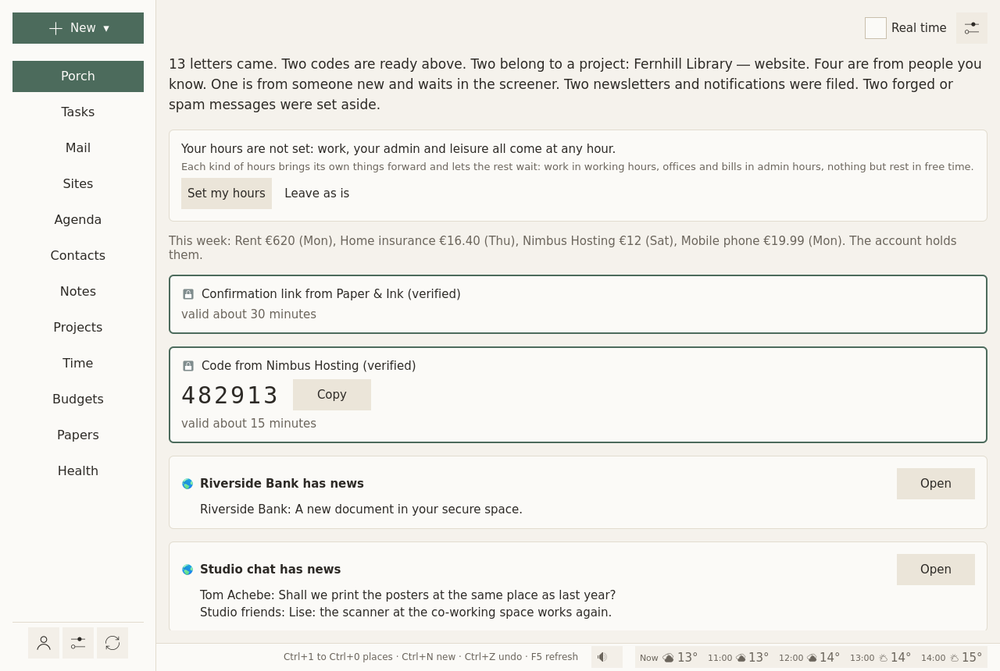

# The Porch

## In short {#in-short}

The Porch is where new mail from every address waits until you look. Before anything is shown, Sioul checks each message, genuine or forged, and sorts it into a lane by who wrote it and what it is for: people you know, someone new waiting in the screener, a project, newsletters, what is set aside. It opens in the hours you choose and stays quiet outside them, while the codes and links you just asked a site for come at once. Nothing is counted at you, and nothing is deleted.

<figure markdown="span">
  [{ loading=lazy }](../assets/screens/porch.png "Open the picture at full size")
  <figcaption>Codes and links on top, the sites' news, then the lanes.</figcaption>
</figure>

## Protected by default {#what-is-protected}

Without any setting:

- **Each message is checked before it is shown.** A forged one, or one borrowing a bank's or a public service's name, is set aside first, whatever your lists say, even when it claims to come from someone you marked safe ([The lanes](#the-lanes)).
- **A stranger's first message waits in the screener** until you let them in. A message that nothing proves comes from its address is treated as a stranger's, whatever address it shows ([Letting someone in](#letting-someone-in)).
- **A fake "your code" message is set aside**, and a code from a sender that is only not verified comes with a warning ([Codes and links](#codes-and-links-come-at-once)).
- **Spam verdicts never touch the people you know**, your codes or your projects' mail ([Spam, and your own filter](#spam-and-your-own-filter)).
- **Nothing is deleted, and closing the Porch marks nothing read** ([Done for now](#done-for-now)). Senders you blocked never appear.

## When it opens {#when-it-opens}

- **In your hours**, the Porch says until when it is open ("Open until 17:00."), then shows what came, sorted into lanes.
- **Outside your hours**, the Porch says when it opens next, and nothing else of your mail: no counts, no names. Your doses of the day still show (below). **Open it anyway** stays possible, quietly. Meanwhile, what comes is checked and sorted.
- **Without any hours set**, the Porch is always open.

Which mail comes when follows who wrote, as each list's row says at each time (safe, neutral, restricted, strangers, your Always through people; the blocked never), and what each address is for: work, your admin, leisure. See [What reaches you, and when](notifications.md#by-person) and [Hours](hours.md).

Mail keeps arriving in the background all the while. The Porch only decides when it is shown, and when it is told ([below](#new-mail-told-at-its-times)).

## Codes and links come at once {#codes-and-links-come-at-once}

One-time codes, temporary passwords, password resets, sign-in links and links to confirm an address come from something you just asked a site for, and they expire. So Sioul shows them at once, whatever the hour, even when they come from a site's automatic address (no-reply…):

- on a computer, one notification, without sound, with the code, a button to copy it (on Linux), and how long it stays valid; none while you sleep: the card waits here;
- the same card on top of the Porch, with **Copy**; on a phone, on the Porch and on Sioul's card on your home screen, since a phone does not notify codes yet.

Nothing else opens with it. Once it has expired, it is hidden, and the message goes to its lane. It expires when the message says, else when its kind usually does: a code after 30 minutes, a sign-in link after an hour, a password reset after two hours, a link to confirm an address after a day, a temporary password after a week.

Many sites send their codes and links through the same services as their newsletters, with the same headers. They still come at once. Sioul looks for the code in their subject and at the top of their text, where a site puts what you asked for: a newsletter's article about passwords stays a newsletter.

Fake "your code" messages are a common phishing trick. A forged one is set aside, even when it carries a newsletter's headers. One from a sender that is only *not verified* still comes, with a warning: use it only if you just asked that site for it.

## New mail, told at its times {#new-mail-told-at-its-times}

When mail your lists let through now arrives, one quiet notification says it, for the whole batch: "Two letters", and the first senders with their subjects: "Murena, Your invoice · Alice, Dinner on Friday". **Open** shows the Porch.

- **What waited** (mail that came outside its list's times, while you slept or paused) is told once, when its time comes: "The Porch opens: three letters wait for you."
- **Never** for codes (they have their own, above), mail set aside, what your own spam filter flagged or moved (it waits in "Caught by your own spam filter", [below](#spam-and-your-own-filter)), blocked senders, your less important addresses, what you send yourself, newsletters unless you include them, or mail you already read elsewhere. Nothing while you sleep or pause.
- **No sound.** With a phone and a computer, only the one you used last tells. On a phone's lock screen, the notification says how many letters came, not who wrote.

Settings ▸ What reaches you ▸ By person ▸ Mail: **Tell me of new mail**, and **Include newsletters** ([What reaches you, and when](notifications.md#by-person)).

## The lanes {#the-lanes}

Each message goes to the first lane that takes it, in this order. Three of them appear only once you set something up, as their rows say.

| Lane | What it holds |
|---|---|
| **Set aside** | Forged mail, mail borrowing a name, and a stranger's mail your provider calls spam ([below](#spam-and-your-own-filter)). Shown at the bottom, each with the reason. Nothing is deleted. Spam has **Not spam**: back in its lane for good, on every device. |
| **Hostile, set aside** | Only for an address you protect against harassment ([below](#a-public-address-protected)): insults, harassment, threats. Their words stay hidden. |
| **Caught by your own spam filter** | What your own spam filter flagged, or moved into the Junk folder, as you chose ([below](#spam-and-your-own-filter)). Folded, without a count, never notified. Sioul learns from it as it is; if one is not spam, **Not spam** puts it back and teaches the filter. |
| **Right now** | Codes and links you just asked a site for, above. |
| **One lane per project** | Mail that matches the project's routes, or that belongs to a conversation of the project. See [Projects](projects.md). |
| **Your public address** | Only for an address you protect: mail from someone you have not let in, read first and sorted by topic, work first. |
| **Less important accounts** | Only once you rank an address below the others ([below](#some-addresses-first-others-last)): its mail, such as social networks or notifications you read now and then, folded at the bottom. |
| **Filed: newsletters and notifications** | Mailing lists, newsletters and automatic senders (no-reply…). Folded. |
| **Someone new, in the screener** | A stranger: in none of your address books and on no list, or on the neutral or restricted list by their domain alone. Also any message that nothing proves comes from the address it shows. You let them in, or not. |
| **From people you know** | People in your address books, those you let in, those on a list by their own address, and those of a domain you marked safe. |

**Senders you blocked** never appear on the Porch: their mail is set aside for good, never shown, never counted and never told. Nothing is deleted.

Mail you send yourself, from one of your addresses to another (a file sent from your phone), comes with the people you know, at any hour, never screened, when it is verified: a forged own address is a classic trick.

Under each lane's title, one line says what it holds. Its **?** (How mail lands here) says, sentence by sentence, how mail lands there, and where to change it.

### Letting someone in {#letting-someone-in}

A message in the screener has **Let this address in**: their next messages go to "From people you know".

Every message also has **How they reach you…**, in its menu (⋮): the sender's sheet. First, one line says what decides for this sender now: "Safe, as the category Friends says." Then their list: **As their categories say** (their own entry taken out of the lists: the categories on their contact card decide, else their address's domain), or one of the four lists: **Safe**, **Neutral**, **Restricted**, **Blocked** (set aside for good, never shown); **Always through**; and what reaches you from them at each time. A sender in none of your address books and on no list is a stranger, with a row of their own. The same lists, with patterns such as `*@example.org` and numbers, and what each does at each time, are in Settings ▸ [What reaches you](notifications.md#by-person).

Forged mail is judged apart: a forged message is set aside whatever the lists say, even if it claims to come from someone you marked safe, and it is weighed as a stranger's.

## Spam, and your own filter {#spam-and-your-own-filter}

Only a stranger's mail is ever judged. Whoever judges it, your provider or Sioul's own filter, it never touches mail from someone you know (in your address books, on a list, let in), the codes and links you asked for, a project's mail, what you send yourself, or a message you said is not spam, on any of your devices. Forged mail, borrowed names and blocked senders are set aside before, as always. A message whose two usual checks both failed, so that nothing proves it comes from the address it shows, counts as a stranger's, whatever address it shows.

- **Your provider's word**: a stranger's message your provider marks as spam goes to Set aside.
- **Your own filter**, once it has learned from your mail ([Mail, Your own spam filter](mail.md#your-own-spam-filter)), finds a stranger's message **probably spam** (from 95% unless you change it), **maybe spam** (from 50%), or **probably not spam**. What it does with each is yours to choose, in its settings:
    - **Move to spam**: as it arrives, the message goes into its address's Junk folder, on the server;
    - **Flag only**: it stays where it is, marked;
    - **Do nothing**: it goes to its lane, as any message.

    Until you choose, it flags what is probably spam or maybe spam, and does nothing with the rest.

What it flags or moves waits in **Caught by your own spam filter**, folded near the bottom of the Porch, without a count: never a notification for it, on any device, nor on your phone's home screen. Nothing there asks for your time: Sioul learns from what the filter caught as it is (what it moved or found probably spam, as spam; a maybe spam, not until you say), and you step in only when one is not spam.

<figure markdown="span">
  [![The Porch. On the left, "Caught by your own spam filter" opened, without a count, with its sentence under the title: what your own filter caught waits there, never notified; Sioul learns from it as it is, and "Not spam" puts one back and teaches the filter. Then strangers' messages, each with its quiet word, "probably spam" or "maybe spam", and Not spam and Spam under it; above them, Not spam for all and Spam for all. The first, which the filter moved into the Junk folder, is open on the right: "Why it is here" says "your own filter: probably spam" and that it was moved into your Junk folder, "Not spam" bringing it back to the inbox; under the message, Spam, Not spam and Close.](../assets/screens/porch-spam.png){ loading=lazy }](../assets/screens/porch-spam.png "Open the picture at full size")
  <figcaption>What your own filter flagged or moved.</figcaption>
</figure>

Each message there has its word, quiet ("probably spam", "maybe spam"), and two buttons:

- **Not spam**: back in its lane, for good, on every device, and the filter learns it is not; one the filter moved goes back to the inbox;
- **Spam**: into the Junk folder, or kept there, for good.

**Not spam for all** and **Spam for all**, above them, answer them all at once. Each can be undone for ten seconds; the filter learns what you said at its next training, your word above its own. What you say on your phone, your computer knows, and the other way round. Sioul says only that your own filter judged it, never why. **Junk** moves a message to the junk folder, as always, and teaches the filter too. Nothing is deleted.

A message the filter moved stays here while it is in the Junk folder and you have said nothing of it; one it flagged, for two weeks, even after you close the Porch with **Done for now**.

## Reading a message {#reading-a-message}

A message opens on the right. Before its text:

- **who sent it**, and how far that is verified: *verified*, *not verified*, or *forged*. Hovering over the shield beside it shows each check ([how a sender is checked](mail.md#how-a-sender-is-checked));
- **to whom**, copied to whom, when, the subject;
- **why it is here**, folded until you ask.

Then the text, made safe:

- HTML mail keeps its paragraphs, lists, bold text and links. Nothing else is shown: no images, no styles, no scripts. Nothing loads from the network, nothing runs.
- Earlier messages that a reply quotes are folded under **Show the earlier messages**. A signature is dimmed.
- Every link shows its full address under the message before it opens: while the pointer is on it, or after a first tap on a touch screen.
- **Attachments** are folded, one line each with their kind, name and size. Opening or saving one runs the antivirus first; if the computer has none, Sioul says so and asks before opening. A phone has none Sioul can call: there Sioul says the file is not checked. A program is never started from a mail. See [Mail, Attachments](mail.md#attachments).

From the message: reply, forward, archive, delete, and the rest, as on the [Mail](mail.md) page. A newsletter has **Unsubscribe** too ([Mail](mail.md#unsubscribing)).

## Done for now {#done-for-now}

**Done for now** closes the Porch on what it showed. Anything newer waits for the next time it opens, even mail that reached the server earlier and arrived here later.

Closing the Porch tells nothing to the server: no message is marked read by it. Only opening a message marks it read, as in any mail program.

An address the Porch was never closed on shows its last two weeks only. Older mail stays in [Mail](mail.md), where it belongs.

## Above the lanes {#above-the-lanes}

When there is something, a few lines come before the lanes:

- **When your hours are not set**, a card asks for them, with **Set my hours** (which opens Settings at them) and **Leave as is** (which stops asking).
- **When your night is not set**, a card says that nothing keeps notifications away while you sleep, with **Set my night** (which opens the Health page where meals and the night are set) and **Leave as is**. See [Hours](hours.md#sleep).
- **Where you stopped**: the line you left when something interrupted you, with its task, until you press **Done**. See [Tasks](tasks.md#starting-and-stopping).
- **Two events at once today**, the time to get there and back counted, with **Open "…"** for each and **Don't mention it again**. See [Agenda](agenda.md#two-events-at-once).
- **Today's doses not marked yet**, from their time on, whether a notification reminded you or not: each with its time, its name and **Taken** (more than half an hour late, **Taken…** asks when you took it). Whatever your hours: a dose is not mail. Each stays until you mark it, the day ends or twelve hours have passed; while you sleep with doses kept silent, they wait for your waking. When another device may know more, the doubt is said under the dose: check before taking it. See [Health](health.md#reminders).
- **Doses due while Sioul was closed**, neither marked nor reminded anywhere: **Taken…** (when you took it) or **Not taken**. When another device may know more, the doubt is said under the dose. See [Health](health.md#reminders).
- **Calls Sioul declined**, on your phone and on your other devices, each at a time its caller may reach you: "While you slept, a number not in your contacts called at 09:30.", with **Text back**, **Call back**, **Listen** when Free mailed the voicemail. See [Calls](calls.md#afterwards-on-the-porch).
- **From your phone**, on a computer, when you send your phone's messages there: who wrote, when and what, at a time they may reach you, with **Text back**, **Call back** and **Seen**. See [What reaches you](notifications.md#messages-on-your-computers).
- **"*The site* has news"**: what the websites you keep in Sioul notified, waiting for you. Opening the site clears its news. See [Sites](sites.md).
- **Paper letters** you scanned, each as a card: who, what, how much, by when. See [Papers and letters](papers.md#paper-letters).
- **This week's payments**, in one line: "This week: Electricity €62 (Mon). The account holds them." When something about money needs a look, it says so, without a count. See [Budgets](budgets.md#the-bank-watch).

<figure markdown="span">
  [{ loading=lazy }](../assets/screens/porch-hours.png "Open the picture at full size")
  <figcaption>Until your hours are set, the Porch asks once.</figcaption>
</figure>

## Why it works this way {#why-it-works-this-way}

- Checking mail three times a day lowered daily stress in a randomised trial (Kushlev & Dunn 2015). Batching notifications helped attention and mood, while having none at all made people more anxious (Fitz et al. 2019): what helps is predictability, not silence. So the Porch opens in hours you choose, and says when.
- Interrupted people work faster, with more stress and frustration (Mark, Gudith & Klocke 2008), and a notification left unanswered still costs attention (Stothart, Mitchum & Yehnert 2015). So nothing pops up outside the times you choose, one notification says a whole batch, and nothing moves under your eyes when mail arrives.
- People avoid information they expect to hurt (Sweeny et al. 2010). So what a message is, who sent it and how far that is verified come before its text.

More in [what the research says](../dev/research.md).

## Going further {#going-further}

### Real time {#real-time}

The **Real time** box, at the top of the Porch, fetches every folder of every address each minute, and keeps the Porch open: for a code or a password you are waiting for. Untick it to go back to the usual pace.

In quiet time, **Work now** appears beside it, to show work whatever the hours. See [Hours](hours.md#work-now).

### A public address, protected {#a-public-address-protected}

An address you publish brings work, and sometimes insults. On its card in [Accounts](accounts.md#a-mail-address), **Protected against harassment** has its mail read on your device before you see it:

- **its tone**: calm, rude, or hostile (insults aimed at you, harassment, threats), from word lists in French and English;
- **its topic**: work, a question, the press, thanks, a donation, something else.

Hostile mail goes to its own folded lane, which shows neither the sender's name nor the subject. Opening one asks first: it can wait, go to someone you trust (**Forward to someone you trust**), or go away (blocked, deleted). Reading it anyway is your choice, at a time that suits you. The rest of the address's mail has its own lane, work first, its topic shown, and a mark when it is rude.

**Let the AI read it first**, below it, is off unless you turn it on. Then the messages in that address's inbox are sent to Anthropic's Claude, whoever sent them, those already there when you turn it on included, so that it says their tone and topic more finely than word lists can. What leaves your device is each message's subject and the first 4,000 characters of its text, as they are: nothing is masked, so a code or an account number in such a message reaches Anthropic too. The key for Anthropic's service is typed once in Accounts and kept in your keyring.

### The Porch's settings {#the-porchs-settings}

The ⚙ at the top of the Porch holds what is the Porch's alone, and how a message opened here reads:

- **Projects shown here**: which projects have a lane on the Porch. The others' mail stays on their page in Projects.
- **Paper letters ▸ Where scans arrive**: the folder your scans come to.
- **Calls ▸ Calls your phones declined**: on unless you turn it off, the calls your phones declined wait on this device's Porch too; off, each phone lists only its own, and your computers none ([Calls](calls.md#on-your-computers)).
- **How text reads**: the font, its size and the space between lines of a message opened here, the same as in the Mail page's ⚙.
- **How mail is sorted**: every lane, in the order mail is sorted, with its rules; the senders you know; the words that make a sender automatic (no-reply…).

What belongs to something else is set where that thing is: an address's rank and protection on its card in [Accounts](accounts.md), a project's routes on its page in [Projects](projects.md), who may write to you when in Settings ▸ [What reaches you](notifications.md#by-person), your hours in [Settings](settings.md#hours).

#### Some addresses first, others last {#some-addresses-first-others-last}

On each address's card in Accounts, **Priority**: *More important*, *Normal* or *Less important*. Mail of the more important addresses comes first in every lane, with a small mark. Mail of the less important ones skips the screener and waits folded at the bottom. Their codes still come at once.

## Compared with other apps {#compared-with-other-apps}

As of October 2026, from each app's own documentation.

✓ documented; **partly**, with a note; ✗ not found in the app's own documentation (for Sioul: not built); ? not confirmed; — not applicable. Sioul's column was checked against its code.

HEY holds the closest idea, its Screener and Imbox; Gmail, Outlook and Apple Mail sort mail into categories or tabs; Superhuman splits the inbox. Proton Mail, Thunderbird and FairEmail are compared on [the Mail page](mail.md#compared-with-other-apps): none of them holds a stranger's first message or shows mail by hours.

| | Sioul | HEY | Gmail | Outlook | Apple Mail | Superhuman |
|---|---|---|---|---|---|---|
| Sorts new mail into lanes by itself | ✓¹ | partly² | ✓³ | partly⁴ | ✓⁵ | ✓⁶ |
| Sections of your own in the inbox (a project, a client) | ✓⁷ | ✗⁸ | ✓⁹ | ✗¹⁰ | ✗¹¹ | ✓¹² |
| A stranger's first message waits until you let them in | ✓ | ✓¹³ | ✗ | partly¹⁴ | ✗¹⁵ | ✗ |
| New mail shown only in the hours you choose | ✓¹⁶ | ✗ | ✗ | partly¹⁷ | partly¹⁸ | ✗ |
| Notifications by who wrote, and when they may reach you | ✓¹⁹ | partly²⁰ | partly²¹ | partly²² | partly²³ | partly²⁴ |
| The code you just asked a site for, at once | ✓²⁵ | ✗ | ?²⁶ | ✗ | ✓²⁷ | ✗ |
| No unread counts or badges | ✓²⁸ | ✓²⁹ | ?³⁰ | ✗³¹ | ✗³² | ✗³³ |
| Forged mail and borrowed names set aside first, with the reason | ✓ | partly³⁴ | partly³⁵ | partly³⁶ | partly³⁷ | —³⁸ |
| Deletes nothing by itself | ✓³⁹ | ✗⁴⁰ | ✗⁴¹ | ✗⁴¹ | ✗⁴¹ | —³⁸ |
| Hostile mail to a public address held back, its words hidden | ✓ | ✗⁴² | ✗⁴² | ✗⁴² | ✗⁴² | ✗⁴² |
| Works with the addresses you already have | partly⁴³ | ✗⁴⁴ | partly⁴⁵ | ✓ | ✓ | partly⁴⁶ |

1. Sioul: people you know, someone new, a project, newsletters and notifications, what is set aside.
2. HEY: you choose, for each sender you let in, the Imbox, The Feed or the Paper Trail; "HEY won't move anything anywhere until you tell it to."
3. Gmail: five fixed categories (Primary, Social, Promotions, Updates, Forums).
4. Outlook: two tabs, Focused and Other.
5. Apple Mail: four fixed categories (Primary, Transactions, Updates, Promotions), since iOS 18.2 and macOS 15.4, not in every country.
6. Superhuman: Important and Other, and ready-made splits (VIP, Team, News, Calendar).
7. Sioul: a lane per project, by its senders, domains or words.
8. HEY: three fixed places; labels, bundles and workflows instead.
9. Gmail: Multiple Inboxes, on a computer, made from searches or labels.
10. Outlook: two tabs; folders and rules instead.
11. Apple Mail: fixed categories; on a Mac, Smart Mailboxes are saved searches beside the inbox.
12. Superhuman: splits of your own by sender, recipient, subject or label.
13. HEY: the Screener; your decision is private and can cover a whole domain.
14. Outlook: Sender Screening, for personal Microsoft accounts, off until you turn it on; new senders' mail waits at the top of the inbox until you allow or block them.
15. Apple Mail has none; the Messages app screens unknown senders.
16. Sioul: outside your hours, the Porch says when it opens and shows nothing else; codes and what you send yourself still come.
17. Outlook: on a phone, notifications can be muted on a schedule; the mail itself still shows.
18. Apple: a Focus, which is a system setting, can show only some accounts at chosen times.
19. Sioul: one quiet notification per batch, at the times each sender's list allows.
20. HEY: notifications off by default, on for the people or threads you choose; no schedule in its documentation.
21. Gmail: all mail, high priority only, or none; per label on Android.
22. Outlook: on a phone, all mail, Focused only, or none, and quiet times.
23. Apple Mail: VIPs and chosen mailboxes; times through the system's Focus.
24. Superhuman: high priority only, or chosen splits on a phone; no schedule in its documentation.
25. Sioul: a notification with **Copy** on a computer; on a phone, on the Porch and the home-screen card, without a notification yet.
26. Gmail: not in Google's documentation; only the press reports a "Copy code" card in its apps.
27. Apple: codes received in Mail fill in by themselves in Safari, since iOS 17 and macOS Sonoma.
28. Sioul shows none; on Android, a launcher may still put a dot on Sioul's icon while a mail notification waits.
29. HEY: no counts, and no badges by design.
30. Gmail: not confirmed in Google's documentation.
31. Outlook: the app's badge counts unread mail, all or Focused only; iOS can turn it off.
32. Apple Mail: badges per account, which you can turn off; on an iPhone the count is the Primary category's.
33. Superhuman: each split shows its number of conversations; the desktop badge counts the current split.
34. HEY: a warning on mail from a sender you let in when it fails its domain's checks.
35. Gmail: a question mark on unauthenticated mail; spam says why, a lookalike of a known sender's address among the reasons.
36. Outlook: a "?" and "via"; impersonation checks only in Defender for Office 365, for businesses.
37. Apple: iCloud Mail applies the sender domain's DMARC policy on its servers; Apple's guides show no reason given in Mail.
38. Superhuman reads Gmail or Microsoft 365 mailboxes: their checks and their deletions apply.
39. Sioul deletes nothing; your provider may empty its own Junk folder (Gmail after 30 days).
40. HEY: spam and screened-out mail deleted after 90 days.
41. Spam deleted after 30 days (Outlook.com: between 10 and 30 days; Apple: in iCloud Mail).
42. They let you block or screen out a sender once you have read them; none holds mail back by its tone.
43. Sioul: any IMAP and SMTP server; not Outlook.com, Hotmail or Microsoft 365.
44. HEY: HEY addresses only; other mail can be forwarded in.
45. Gmail: other accounts in its phone apps; on the web, until January 2027.
46. Superhuman: Gmail and Microsoft 365 accounts only.

??? info "Sources"
    Superhuman's help centre was read through its own public interface, since its pages refused automated reading that day.

    - HEY, features (the Screener, the Imbox, The Feed, Paper Trail, notifications, workflows): <https://www.hey.com/features/>, read 8 October 2026.
    - HEY, the HEY way (no numbers): <https://www.hey.com/the-hey-way/>, read 8 October 2026.
    - HEY, notifications (no badges): <https://help.hey.com/article/772-notifications>, read 8 October 2026.
    - HEY, spoofed senders: <https://help.hey.com/article/741-how-did-a-spammer-spoof-my-email-address>, read 8 October 2026.
    - HEY, emptying the trash, spam and screened-out mail (90 days): <https://help.hey.com/article/1014-empty-trash-spam-or-screened-out>, read 8 October 2026.
    - HEY, labels: <https://help.hey.com/article/884-labels>, read 8 October 2026.
    - HEY, frequently asked questions (no IMAP, forwarding in): <https://www.hey.com/faqs/>, read 8 October 2026.
    - HEY, apps: <https://www.hey.com/apps/>, read 8 October 2026.
    - Gmail, categories: <https://support.google.com/mail/answer/3094499>, read 8 October 2026.
    - Gmail, inbox types and Multiple Inboxes: <https://support.google.com/mail/answer/186531>, read 8 October 2026.
    - Gmail, notifications: <https://support.google.com/mail/answer/1075549>, read 8 October 2026.
    - Gmail, authentication: <https://support.google.com/mail/answer/180707>, read 8 October 2026.
    - Gmail, spam and the reasons shown: <https://support.google.com/mail/answer/1366858>, read 8 October 2026.
    - Gmail, spam and trash deleted after 30 days: <https://support.google.com/mail/answer/7015314>, read 8 October 2026.
    - Gmail, other accounts: <https://support.google.com/mail/answer/16604719> and <https://support.google.com/mail/answer/17101213>, read 8 October 2026.
    - Outlook, Focused Inbox: <https://support.microsoft.com/en-us/outlook/mail/focused-inbox-for-outlook>, read 8 October 2026.
    - Outlook, Sender Screening: <https://support.microsoft.com/en-us/outlook/sender-screening>, read 8 October 2026.
    - Outlook, notifications and quiet time: <https://support.microsoft.com/en-us/outlook/how-can-i-turn-push-notifications-and-sounds-on-or-off>, read 8 October 2026.
    - Outlook, the badge count: <https://support.microsoft.com/en-us/outlook/what-does-the-badge-count-icon-represent-and-how-do-i-change-it>, read 8 October 2026.
    - Outlook, phishing and suspicious behaviour: <https://support.microsoft.com/en-us/outlook/mail/phishing-and-suspicious-behavior-in-outlook>, read 8 October 2026.
    - Outlook, anti-phishing policies in Defender for Office 365: <https://learn.microsoft.com/en-us/defender-office-365/anti-phishing-policies-about>, read 8 October 2026.
    - Outlook, junk filter (30 days): <https://support.microsoft.com/en-us/outlook/filter-junk-email-and-spam-in-outlook>, read 8 October 2026.
    - Outlook, mail sent to junk by mistake (10 to 30 days): <https://support.microsoft.com/en-us/office/mail-goes-to-the-junk-folder-by-mistake-f409b58c-2617-47e2-8a97-cab612d98eff>, read 8 October 2026.
    - Apple Mail, categories: <https://support.apple.com/guide/iphone/use-categories-iphfe4a36baf/ios>, read 8 October 2026.
    - Apple, versions with categories: <https://support.apple.com/en-us/121161> and <https://support.apple.com/en-us/120283>, read 8 October 2026.
    - Apple Mail, rules and Smart Mailboxes on a Mac: <https://support.apple.com/guide/mail/automatically-sort-incoming-emails-mlhlp1190/mac>, read 8 October 2026.
    - Apple Mail, Focus filters: <https://support.apple.com/guide/iphone/filter-emails-iph057d5e515/ios>, read 8 October 2026.
    - Apple Mail, notifications and VIPs: <https://support.apple.com/guide/iphone/set-email-notifications-iphc13a970c8/ios>, read 8 October 2026.
    - Apple Mail, checking your mail (the badge count): <https://support.apple.com/guide/iphone/check-your-email-iph461684497/ios>, read 8 October 2026.
    - Apple, codes from Mail: <https://support.apple.com/en-us/118723>, read 8 October 2026.
    - Apple, macOS Sonoma announcement (codes from Mail in Safari): <https://www.apple.com/newsroom/2023/06/macos-sonoma-brings-new-capabilities-for-elevating-productivity-and-creativity/>, read 8 October 2026.
    - Apple, screening unknown senders in Messages: <https://support.apple.com/guide/iphone/screen-and-filter-texts-iph203ab0be4/ios>, read 8 October 2026.
    - Apple, iCloud Mail's checks: <https://support.apple.com/en-us/102322>, read 8 October 2026.
    - Apple, junk mail in iCloud (30 days): <https://support.apple.com/guide/icloud/manage-junk-mail-mm6b1a2ced/icloud>, read 8 October 2026.
    - Superhuman, default Split Inbox: <https://help.superhuman.com/hc/en-us/articles/46005619081101-Default-Split-Inbox>, read 8 October 2026.
    - Superhuman, custom Split Inbox: <https://help.superhuman.com/hc/en-us/articles/46005636204941-Custom-Split-Inbox>, read 8 October 2026.
    - Superhuman, email notifications (and badges): <https://help.superhuman.com/hc/en-us/articles/46005802618765-Email-Notifications>, read 8 October 2026.
    - Superhuman, managing accounts: <https://help.superhuman.com/hc/en-us/articles/46005777934733-Managing-Accounts>, read 8 October 2026.
    - Superhuman, keeping your emails out of spam (filtering is the provider's): <https://help.superhuman.com/hc/en-us/articles/46005520093453-Keeping-Your-Emails-Out-of-Spam>, read 8 October 2026.
    - Superhuman, download (platforms): <https://help.superhuman.com/hc/en-us/articles/46005778798605-Download-Superhuman-Mail>, read 8 October 2026.

## For technical readers {#for-technical-readers}

### The order of the lanes {#the-order-of-the-lanes}

The lanes are decided in this order, what protects you most first: set aside (forged, a borrowed name, your provider's spam on a stranger's mail); hostile, for a protected address; your own filter's catches; codes and links; a project; mail from yourself, when it is verified; a protected address's own lane; less important addresses; newsletters and automatic senders (`List-Id`, `List-Unsubscribe`, `Precedence: bulk`, addresses such as no-reply); the screener; people you know. A message in a conversation that a project holds goes to that project too, unless it was set aside, is a code, or is hostile. Blocked senders are left out before any of this.

### Before any list is read {#before-any-list-is-read}

Each message is checked first ([how a sender is checked](mail.md#how-a-sender-is-checked)). Forged mail and borrowed names are set aside whatever your lists say, even when they name someone you marked safe. Mail nothing authenticates (SPF and DKIM both failed, with no DMARC pass and no ARC seal from your provider or one of your domains) is read as a stranger's: no People lane, a stranger's times, no protection from spam, and no project lane by its address. Spam verdicts apply to strangers only, whether your provider's (SpamAssassin's or rspamd's headers, read only where your provider wrote them) or your own filter's: never to your address books, your lists, those you let in, a code, a project's mail, your own verified mail, or a message you said is not spam, on any device or in another mail program (`$NotJunk`).

### Codes {#codes}

Each inbox stays open with IMAP IDLE (RFC 2177), renewed every five minutes, so a code reaches you within seconds of reaching your provider. The detector reads French and English: codes of 4 to 8 digits, grouped or prefixed (`123-456`, `G-482913`), letters and digits beside their words; temporary passwords, resets, sign-in links and addresses to confirm. Dates, prices, phone numbers, postcodes and shops' codes are left out. With a newsletter's headers, only the subject and the first 1,000 characters are read, where a site puts what you asked for. A code lasts as long as its message says, a week at most; otherwise 30 minutes, a sign-in link an hour, a reset two hours, an address to confirm a day, a temporary password a week. A code that fails DMARC under its domain's policy is forged, list headers or not.

### What the Porch keeps, and where {#what-the-porch-keeps-and-where}

Fetching uses `EXAMINE` and `BODY.PEEK`, so nothing is marked read. **Done for now** is kept on your device, as the newest message shown for each address (its UIDVALIDITY and UID), and reaches your other devices sealed when you share between them; the server is never told.

### Notifications {#notifications}

Each device keeps a ledger of what it told, hashed (no address, no Message-ID), for 30 days, so that nothing is told twice. With a phone and a computer, only the device you used last tells. Only a batch with someone Always through in it passes do-not-disturb.

### The AI reading of a protected address {#the-ai-reading-of-a-protected-address}

Off unless you turn it on for one address. Then each message in that address's inbox that the AI has not read yet, whoever sent it, is sent to Anthropic's API (Claude Haiku 4.5), the newest first, twenty at a time: its subject and the first 4,000 characters of its text, unmasked. Claude answers with a tone, a topic and one neutral line; the answer is kept on your device under the message's Message-ID and a digest of who sent it and what it says, so that the message is not sent again, and a message borrowing another's Message-ID is read anew. An answer not in the form asked is not kept: the word lists judge that message, and it is sent once more at most, at the next round; after a second such answer, never again, so that its subject and text do not go to Anthropic round after round. The key for Anthropic's service stays in your keyring, and no redirect is followed, so that the key goes to Anthropic alone.
