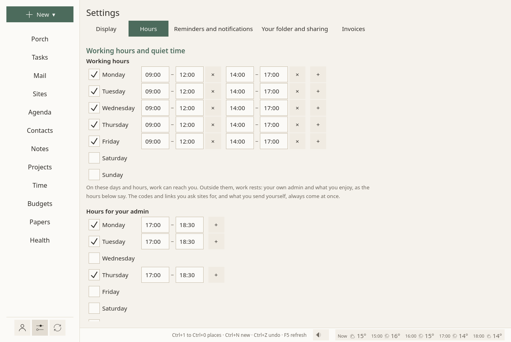

# Settings

**Settings** is the sliders icon at the bottom of the left column. It holds what belongs to Sioul as a whole. What belongs to one page is on that page, behind its ⚙ (below).

Each setting says in one sentence what it changes, and is saved at once. Nothing to confirm, nothing to apply.

The Settings page has five tabs.

## Display

- **Language**: the system's, English or French. Every sentence Sioul says follows it.
- **Colours**: light, dark, or as the system has them. The icons follow at the next start.
- **Show passwords as you type**: every password, passphrase and key field shows what you type from the start, on this computer. Without it, the eye at the end of each field shows or hides what you typed, at any time.

## Hours

<figure markdown="span">
  [{ loading=lazy }](../assets/screens/settings-hours.png "Open the picture at full size")
  <figcaption>Three weeks: work, your admin, free time. Then time off.</figcaption>
</figure>

- **Working hours**: on these days and hours, work can reach you. Outside them, work rests.
- **Hours for your admin**: your own admin comes forward then: offices, bills, letters, health errands.
- **Free time**: rest and leisure only: friends, family, chats, what you enjoy.
- **Time off**: holidays, sick leave, quiet from the first day to the last, as on a day off, with a word on them.

Each day of each week is on or off, with one range of hours or several: **+** adds a range, **×** takes one away. What each kind of hours brings, and what waits: [Hours](hours.md).

## Reminders and notifications

Each reminder comes once, as a quiet notification, without sound, never repeated. Remembering "on the 30th" is what fails most, with autism and with ADHD (Landsiedel, Williams & Abbot-Smith 2017; Altgassen, Kretschmer & Kliegel 2014), and reminders help where memory is the bottleneck (Jamieson et al. 2014).

- **Events, the working day before**: half an hour before work ends, the working day before an event: what, when, where. The alarms an event carries are told at their time too.
- **Dates asked: working days before**: when work starts, so many working days before a task's date asked (2 unless you change it); 0 for none.
- **A wait over**: when a wait after a step done is over (an answer due), once, when work is there.
- **Payments planned: working days before**: when work starts, so many working days before a planned payment (a bill, a tax); 0 for none. The reminder says whether the account will hold it.
- **With Sioul's window closed**: your session starts a small watcher that tells reminders when the window is closed; nothing else runs, no mail is fetched. It needs the `sioul` command installed next to Sioul ([Install](install.md#into-your-application-menu)). Not on Windows yet.
- **Sites' notifications gathered**, and **Gathered at**: what your sites notify waits, then comes in one notification at these times, for the sites of those hours: 09:00, 13:00 and 18:00 unless you set others. A site in real time, and a call, come at once.

Doses of medicine are reminded from the [Health](health.md) page, and papers to renew from [Papers](papers.md).

## Your folder and sharing

- **The notes folder**: your folder of Markdown files, read as a vault: your notes, and beside them your projects, budgets, papers and letters. Sioul links to it; it never owns it.
- **Between your computers**: sharing what Sioul keeps on this computer alone with your other computers, sealed with a passphrase. See [Sharing between your computers](sharing.md).

## Invoices

Printed on the invoices you make from [Time](time.md#invoices) and [Projects](projects.md):

- **Your name or business name**, **Your address** (on lines, as on an envelope);
- **SIRET**, or the business number where you are; empty until you are registered;
- **VAT line**: for a French micro-entrepreneur, « TVA non applicable, art. 293 B du CGI »;
- **Invoice numbers start with**: numbers then follow each other, 2026-001, 2026-002…;
- **Currency**: a three-letter code, such as EUR, USD, CHF;
- **Payment details**: printed at the bottom: bank details, terms, late fees;
- **Invoices go into**: the folder of their PDFs, `Documents/Invoices` in your home folder when empty;
- **An hour costs**: the rate when a project does not set its own.

## Each page's own settings

One setting, one place. What belongs to a page is behind the ⚙ at the end of that page's first row:

| Page | Behind its ⚙ |
|---|---|
| [Porch](porch.md#the-porchs-settings) | the projects shown there, where scans arrive, how mail is sorted |
| [Mail](mail.md#settings) | by conversation, how often folders are fetched |
| [Tasks](tasks.md#the-tasks-settings) | office hours, kinds, categories, task lists, where new tasks go, what is work and what is yours, GitHub |
| [Agenda](agenda.md#the-agenda-settings) | calendars, the hour the day opens on |
| [Contacts](contacts.md#the-contacts-settings) | address books, the map |
| [Notes](notes.md#new-notes) | where new notes go |
| [Sites](sites.md#logins-from-bitwarden) | your Bitwarden account |
| [Health](health.md#your-watch) | your watch's folder, gentle offers |

Each address's own settings are on its card in [Accounts](accounts.md#a-mail-address). Wherever long text is read (a message, a note), **Aa** sets the font, its size and the space between lines.

## Where settings are kept

In one plain text file, `config.toml`, in your configuration folder (`~/.config/sioul/` on Linux). You can read it and change it by hand: when Sioul writes it, your comments stay.
