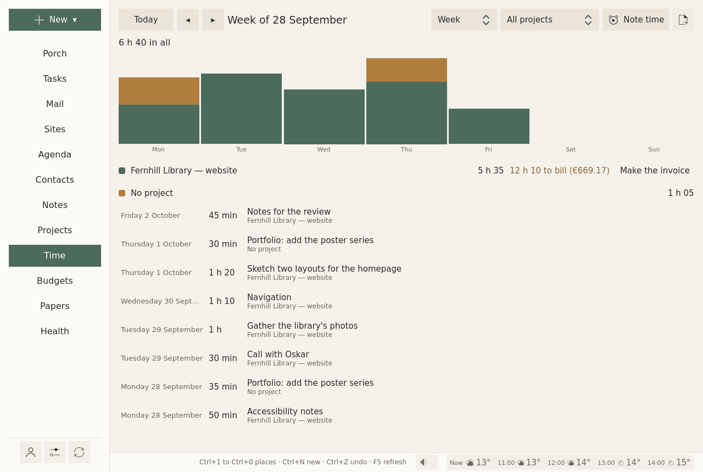

# Time and invoices

Time spent is noted as you work. It is kept for two uses:

- **billing**: the hours you work for clients become invoices;
- **planning**: set beside your guesses, it tells how long things really take. The plan will use it next: see [How long things take](#how-long-things-take).

<figure markdown="span">
  [{ loading=lazy }](../assets/screens/time.png "Open the picture at full size")
  <figcaption>A week of time, by project, and what is left to bill.</figcaption>
</figure>

## The Time page

**Week**, **Month** or **Year**, for **All projects** or one; **Today** and the arrows ◂ ▸ move through time:

- a bar per day (per month, over a year), stacked by project;
- each project's hours, and what is left to bill, in hours and in money at its rate;
- then each stretch of time, newest first.

## Where time comes from

- **The focus timer**: the minutes of a [focus session](tasks.md#starting-and-stopping) count for its task, and for the task's project.
- **Note time**, on this page, on a project's page, or with **New ▾ ▸ Time spent**: a meeting, a call, work done away from the timer. **For** (a project, or a task), **How long** (`1h30`, `45m`, `90`), **When**, **What it was**, and **Not to bill** when it should not be.

While a focus session runs, a notification shows it: its task, since when, and **Pause** (**Go on** once paused) and **Stop**, which do what the focus window's buttons do. On a computer it stays among the desktop's notifications while Sioul is open (in KDE Plasma, under the bell once its popup goes), and goes when Sioul quits. On a phone, a chronometer counts in it, and its buttons work with Sioul in the background or closed. Paused or stopped elsewhere, in the focus window or on another device, it follows.

Click any stretch of time, timed or noted by hand, to change it: its task, its project, its day, from when to when, and what it was; the time the timer kept after a pause you missed comes back that way. A right click also offers **Take this time out**. Time already on an invoice stays as it was billed.

### Billed or not

Work for a client is billed. A task can say otherwise, under **Billed** in its panel: *As its project says*, *Its time is billed*, or *Not billed*.

## How long things take

A task's **Takes about** is a guess. The time noted for it is what it took. The two together tell how your guesses compare with the time things really take.

**Today**, the record is there: the focus window, the time on this page, each line open to change. The plan does not use it yet: it plans each task by its **Takes about**, as you wrote it.

**Next**, the plan will use it to correct your guesses, in the plan only:

- it compares the time spent with the time guessed, over about the past two weeks, for each kind of task;
- it sizes the plan with that ratio: if letters took twice what you guessed, the next letter gets twice its guess in the plan;
- the margin for the unexpected stays on the whole day, not on each task.

It never scores you, never shows anything as late, never fills in **Takes about** for you, and never compares you with anyone.

Timing leisure is up to you. Gaps are fine: time not noted is left out, not counted against anything.

## A spreadsheet of billable time

The export button, at the top right of the Time page: **Billable time, as a spreadsheet (CSV)…**, for one project, and a stretch of time (this week, last week, this month, last month, all time, or from one day to another). One line per task, with its hours, the hourly rate and the amount, then the total. In French, the file uses `;` and a decimal comma, as French spreadsheets read them.

## Invoices

On a project's page, or beside the project on the Time page, **Make the invoice** when billable time waits.

- **Numbers** follow each other within a year and are never reused: 2026-001, 2026-002, or your own prefix.
- **Lines**: one per task (or per note of time noted without a task), its hours at the project's rate.
- **Billed once**: the time an invoice bills carries its number; the next invoice leaves it out.
- **The mentions French law asks for**: your name, address and SIRET, the VAT line ("TVA non applicable, art. 293 B du CGI" for a micro-entrepreneur), payment details, late-payment penalties and the €40 recovery fee.
- **The PDF** (A4) goes to `Documents/Invoices` in your home folder, or the folder you chose. **Print again** writes it anew.
- **Your budget**: the total is expected in the project's budget, due thirty days later. **Paid** dates it today, and the money counts.

Your name, address, numbers, currency, payment details and hourly rate are set once, in [Settings ▸ Invoices](settings.md#invoices).

### On several computers

An invoice number must never be given twice. When you [share between your computers](sharing.md), one computer numbers the invoices: another says "Invoices are numbered on …", and **Make invoices on this computer** takes them over, after a minute and a half, once your other computers know. If your sharing folder cannot be written, or another computer has not been heard from for a few minutes, Sioul waits rather than risk a number twice.

## In quiet time

Outside working hours, the Time page waits behind **Show anyway**. See [Hours](hours.md).
