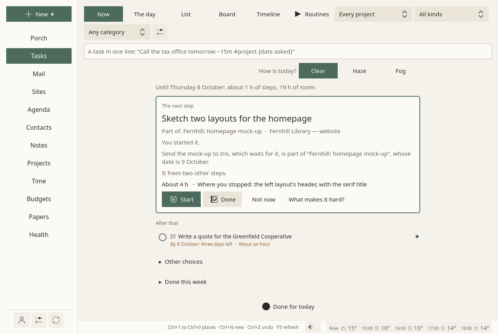
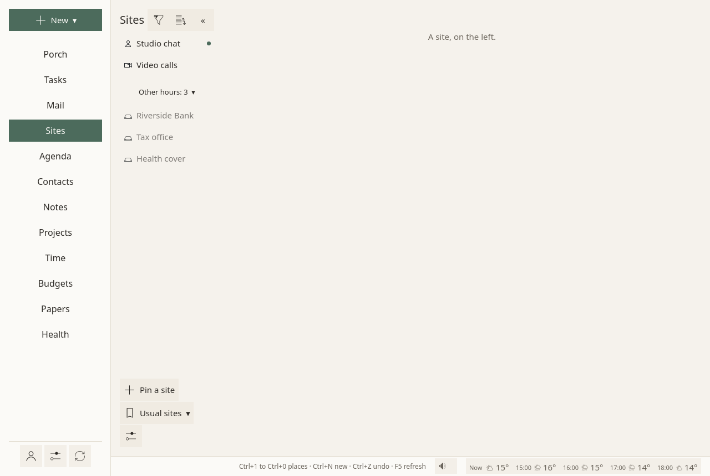
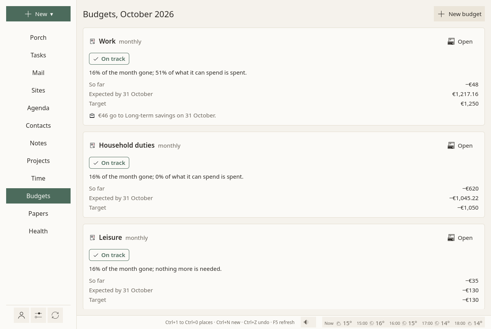

# Sioul

*Sioul* [siwl] is Breton for calm, peaceful, silent.

**Most software expects people to adapt to it. Sioul adapts the demands of the world to the person.**

The administrative machinery of modern life assumes someone always available, always at full strength, who remembers how a dozen separate systems relate to each other. Sioul starts from the other end, from what you can give today: your attention, your energy, your health, your rest. It protects those first, and fits work, institutions and money into what is left.

A letter from the tax office, the task it asks for, the appointment, the document, the person who sent it and the payment all belong to one case. You do not have to keep their relationships in your head: Sioul keeps them.

**Sioul is a personal administrative environment.** It connects what modern life scatters across mailboxes, websites, calendars, task lists, folders and banks, and decides what belongs in your attention from what you have said you can give: your hours, and how today is. It is a quiet place between you and that machinery, on your own devices.

<figure markdown="span">
  [{ loading=lazy }](assets/screens/porch.png "Open the picture at full size")
  <figcaption>The Porch: what came in waits for the hours you chose; the codes you just asked for come at once.</figcaption>
</figure>

## Why Sioul exists

Sioul is the working counterpart of a book by the same author, *Design and Engineering, in Spite of Open-Source* ([free, in PDF and EPUB](https://editions.aurelienpierre.com/en/concevoir/)). The book states: "A tool serves its user, or it betrays them. There is no in-between." Sioul applies its method where software most often leaves the burden on the person: everyday admin.

One test for everything added to Sioul: does it take work off the person, rather than move it somewhere else?

## The other way round

| Most software | Sioul |
|---|---|
| Your obligations fill the day; your needs fit around them. | Your needs shape the day; the work fits around them. |
| Everything shows the moment it arrives. | Only what belongs in your attention now is shown. |
| Each kind of thing has its own program, and you keep the links. | Each piece is tied to the others, and Sioul keeps the links. |
| A missed date becomes overdue work. | The plan starts again from today. Nothing becomes a debt. |

**These are not four interface choices. They are the four rules from which the rest of Sioul follows.**

## Day to day

### Your needs first, then the work

You set your meals, your rest and your sleep first. They are kept free in the plan, and so is the time to get ready, get there and come back around each event. Each day, you can say how it is: clear, haze or fog; a hazy or foggy day holds less. At its end, you can say whether it was too much, about right or too empty, and from that the plan learns how much a day holds for you; it never guesses your state from what you do. The work goes in what remains, in the hours set for it, as one next step, with the reason it comes now. Nothing is ever overdue: a date in the plan is not a debt.

### A porch between the world and your attention

Nothing new walks straight in. Mail, the news from the "secure mailboxes" of banks and offices, chats: everything waits on the Porch, sorted, and shown in the hours you chose. The question is not what has arrived, but what belongs in your attention now: a client in your working hours, the tax office in your admin hours, nobody's work in the evening. Each message is checked first, genuine or forged. The codes you just asked a website for come at once.

### Nothing to be afraid of getting wrong

No unread counts, no badges, no red, no streaks; new mail makes no sound, and nothing moves under your eyes. Anything moved, deleted or sent can be undone for ten seconds. Forged mail is set aside, with the reason. Nothing is sent, deleted or paid without you, not even by an AI agent. The words get the same care: a reminder says what it is, without calling you ill or praising you; stopping early is said as the ordinary thing it is; no forced cheer, no talking down.

## The software keeps the links

Most software splits a case across a mail program, a calendar, a task list, a folder and a bank's website, and leaves you to remember how the pieces relate.

In Sioul, each case is a project: a tax return, a lease, a client's work, any matter you follow. Its mail comes to it by itself, by sender or by words. Its tasks, events, notes and the people involved are tied to it, and each task, contact or note shows what it is tied to. The project lays it all on one line of time: what is coming, then what happened. Your own business too: a client's mail, the tasks, the time spent, the invoice, the money expected and the figures for your accountant form one chain.

## When capacity changes

Sioul was designed first for people for whom administration is especially costly: autistic people, people with ADHD, people dealing with anxiety, trauma, burnout, depression or exhaustion, and people whose energy or cognition fluctuates. The same needs come with long COVID, ME/CFS and other conditions that limit energy, with an eating disorder or irregular eating, with caring for someone, with a bad stretch of life.

Putting off a letter is not laziness: it protects your mood for now (Sirois & Pychyl 2013). And administrative burden weighs most on the people with the fewest resources left, executive function and health among them (Christensen et al. 2020). Sioul works from what a day can hold, which changes, not from a diagnosis: it needs none, and guesses nothing about your state. You say what you can do, and it plans around that.

Many neurodivergent people work for themselves, because office life does not fit them, and that brings more admin of exactly the hard kind: quotes and invoices, taxes, contributions, clients, the bank. So Sioul also carries a small business, from a client's first mail to the paid invoice ([below](#working-for-yourself)).

## In the window

-   :lucide-inbox:{ .lg .middle } __The Porch__

    ---

    New mail from every address, checked and sorted into lanes; the news of the sites you keep; the codes you asked for, at once.

    [The Porch](guide/porch.md)

-   :lucide-list-checks:{ .lg .middle } __One next step__

    ---

    The one step to take now, and why; the day laid out around your meals and appointments. Starting is helped, and stopping counts.

    [Tasks](guide/tasks.md)

-   :lucide-sunrise:{ .lg .middle } __Hours set in advance__

    ---

    Working hours and hours for your own admin; leisure every other time; meals and sleep from Health. Each address, site, budget and task belongs to one or several; the rest waits, out of sight. While you sleep, nothing disturbs but your doses.

    [Hours](guide/hours.md)

-   :lucide-heart-pulse:{ .lg .middle } __Meals, rest, medicines__

    ---

    Meals, naps and the night kept free in your plan, and moved for one day in a tap. Each dose reminded once; when Sioul cannot know whether it was taken, it says so. Nothing about food: no portions, no numbers, no "missed".

    [Health](guide/health.md)

-   :lucide-folder-open:{ .lg .middle } __Everything tied together__

    ---

    Mail, agenda, contacts, notes, projects, time and invoices, budgets and bank accounts, papers and paper letters, medicines, and the websites you have to check.

    [The window](guide/first-steps.md#the-window)

-   :lucide-house:{ .lg .middle } __Yours__

    ---

    Plain files and your own accounts. What your devices share goes sealed end to end, through a folder your own sync app carries. No server of ours.

    [Sharing between your devices](guide/sharing.md)

<figure markdown="span">
  [{ loading=lazy }](assets/screens/tasks-now.png "Open the picture at full size")
  <figcaption>Tasks: one next step, and why.</figcaption>
</figure>

<figure markdown="span">
  [{ loading=lazy }](assets/screens/sites.png "Open the picture at full size")
  <figcaption>Sites: secure mailboxes and chats, logged in once.</figcaption>
</figure>

<figure markdown="span">
  [{ loading=lazy }](assets/screens/budgets.png "Open the picture at full size")
  <figcaption>Budgets: on track or not, said in words.</figcaption>
</figure>

<figure markdown="span">
  [{ loading=lazy }](assets/screens/settings-hours.png "Open the picture at full size")
  <figcaption>Hours: work, your admin.</figcaption>
</figure>

Your Google calendars, contacts and tasks can come too. If you sign in with your Google account, Sioul reads and writes them, only to show them beside the rest of your admin and to save the changes you make there, and keeps a copy on your device. Nothing goes to the developer. What it reads, where it keeps it, and how to take the access back: [privacy policy](privacy.md#google-calendars-contacts-and-tasks).

## Working for yourself

Freelancers, consultants, the self-employed: the work you sell and the admin it brings live in the same window, from the client's first mail to the paid invoice.

- **A project per client**, whose mail comes to it by itself: by the client's domain or addresses, by words in a subject or in an attachment's name.
- **Time counted while you work.** The focus timer counts for the task and its project; a meeting or a call is noted in a few keys: `1h30`. The same record teaches the plan [how long things take](guide/time.md#how-long-things-take).
- **What is left to bill**, for each project, in hours and in money, always in view.
- **The invoice in one click**: a line per task at the project's rate, numbers that never skip or repeat, the mentions French law asks for, a PDF; then the money expected in your budget until it is paid.
- **A spreadsheet for your accountant**, and the same time and invoices on your desktop and your laptop, sealed end to end.

No time tracker, timesheet or invoicing service beside it, and no subscription: your clients and your invoices stay in your own files. [Working for clients](guide/clients.md)

<figure markdown="span">
  [{ loading=lazy }](assets/screens/projects.png "Open the picture at full size")
  <figcaption>A client's project: its tasks, its time, its mail and its invoices, on one line of time.</figcaption>
</figure>

## Built on research, and on refusals

Each rule in Sioul comes from a chain: what studies observed, why, the rule it gives, what Sioul does, and what it refuses. Five of them:

- **Capacity changes, and only you know when.** Autistic burnout eases when expectations are lowered (Raymaker et al. 2020); adults with ADHD liked a "brain weather" view, and disliked tools that watch them (Chen, Meng & Nie 2026). So you say how the day is, and nothing is guessed.
- **Fewer, predictable looks at mail.** Checking mail three times a day lowered stress in a randomised trial; batched notifications helped attention and mood, while none at all made people more anxious (Kushlev & Dunn 2015; Fitz et al. 2019). So mail waits for the hours you chose, and Sioul says when they come.
- **Starting is the hard part.** Autistic inertia, a difficulty acting on intentions, eases with outside scaffolding (Buckle et al. 2021); with ADHD, help belongs at the point of performance (Barkley 2012). So Sioul picks one small next step, and says why.
- **Evenings are for recovery.** Detaching from work after hours goes with less exhaustion, and merely expecting work mail in the evening does harm (Wendsche & Lohmann-Haislah 2017; Becker et al. 2021). So work rests outside your working hours.
- **Progress, never streaks.** Broken streaks lower later engagement, more so when people blame themselves (Silverman & Barasch 2023). So Sioul shows what got done, and never counts what did not.

Sioul also refuses what other software does, each time with the evidence: streaks, trophies and points; counts of what is "overdue"; repeated reminders; scores, charts and calendars of mood, symptoms or energy; guessing your capacity or your mood from your behaviour or from a watch; a schedule that moves things without asking; an AI or a service that sends, books or pays on its own.

All the findings, with their sources and the rule each one gives: [what the research says](dev/research.md). Each study in detail, how strong its evidence is, and what was built, left for later or refused: [the research notes](dev/research/README.md). Not known yet: whether Sioul itself lightens admin. That is still to be measured, with the people who use it.

## An act of care

The conclusion of *Design and Engineering, in Spite of Open-Source* uses "a word engineering never utters: to design is to care". It also describes what happens to the people least equipped for it: "First, everyone is conscripted to the computer, for tasks that got done fine without it; then the least equipped are technically set up to fail; then they are made to carry the blame." Everyday admin is where this happens most.

The same reasoning decides how Sioul is built. Your data stays on your devices, in plain files and open formats, and in your own accounts. Your notes are a folder of Markdown files that Obsidian and Nextcloud Notes read as their own ([Notes](guide/notes.md#the-same-folder-as-obsidian-and-nextcloud-notes)). What travels between your devices goes sealed, through a folder your own sync app carries. There is no server of ours, and nothing reaches the developer. The code is free software, under the GPL. A tool meant to lift the weight of administrative machinery cannot, without contradicting itself, tie you to a service you cannot leave.

## Where it stands

Sioul is young (version 0.0.1) and changes often; it is used every day. Packages for Windows, macOS (Apple silicon and Intel) and Linux (AppImage and Flatpak) are on [the releases page](https://github.com/aurelienpierre/sioul/releases/latest) ([Install](guide/install.md)): built and tested by GitHub, used daily on Linux, little tried elsewhere yet. An Android version is being tried on a phone, with the doses reminded and the sharing working; it is not ready to install.

It is made by one person, in the open: no support is promised. Questions and reports are welcome in [GitHub issues](https://github.com/aurelienpierre/sioul/issues).

## Where to start

1. [Install Sioul](guide/install.md).
2. [Take the first steps](guide/first-steps.md): add your mail, your calendars and contacts, your Google account, the websites you check.
3. [Set your hours](guide/hours.md), so that work, admin and rest each have their time.
4. Then read about [the Porch](guide/porch.md), where new mail waits.

## For technical readers

- **Every message checked on arrival**: SPF, DKIM, DMARC, ARC and reverse DNS, by Sioul itself. Forged mail is set aside with the reason. Names borrowed from brands are caught, even when written with look-alike letters ([Privacy and security](guide/privacy-security.md)).
- **Attachments scanned before they open**, by your system's antivirus: ClamAV on Linux and macOS, Microsoft Defender (through AMSI) on Windows.
- **HTML mail made safe**: nothing remote loads, nothing runs.
- **Security keys and Bitwarden**: WebAuthn and FIDO2 keys (a YubiKey) work in the sites you keep. Logins are filled from Bitwarden, read by Sioul itself and never written.
- **OpenPGP**: signing and encrypting as you send, with Autocrypt and the Web Key Directory.
- **Sharing between your devices**, a phone included: each device keeps its own data; a folder that any sync app carries (Nextcloud, Dropbox, Syncthing, Google Drive, OneDrive…) passes changes between them, each device writing only its own file, sealed end to end (XChaCha20-Poly1305, the key made from your passphrase by Argon2id). Notes and papers travel file by file; earlier versions are kept on each device. No server of ours. [How it works, and what it protects](guide/sharing.md).
- **AI agents**, only if you connect one: `sioul mcp` serves an agent what Sioul keeps on this device, through the Model Context Protocol. It never sends, deletes or pays.
- **Open standards and plain files**: IMAP, SMTP, CalDAV and CardDAV, tasks linked as RFC 9253 says, Maildir, TOML, and notes in Markdown, fully compatible with Obsidian vaults (wikilinks, embeds, tags, front matter, aliases) and with Nextcloud Notes (`.txt` or `.md`, categories as folders). What works with what, feature by feature, and how far each was tested: [Works with](guide/compatibility.md).
- **Free software**, under the GPL-3.0-or-later licence, written in Rust, with a Qt 6 window.

For developers: [the design notes, the architecture, and how to build and test](dev/index.md).

